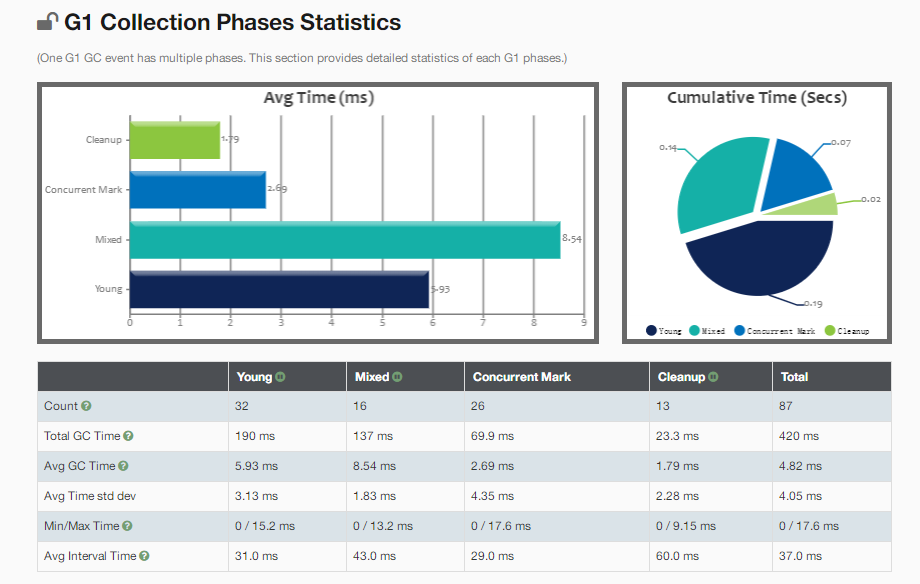

# Week02（20220515） 作业题目

## **1.（选做）**使用 GCLogAnalysis.java 自己演练一遍串行 / 并行 /CMS/G1 的案例。

- 准备工作

  1）编译 GCLogAnalysis.java

  ```shell
  javac -encoding UTF-8 GCLogAnalysis.java
  ```

  编译结果：

  

  2）实验目的：观察各种GC在不同堆内存配置策略下的垃圾回收效率：总GC次数，Minor GC次数，Major GC此处，GC暂停的最小/平均/最大时间；

  对比不同GC的回收效率

  3）实验思路：同一种GC下在不同内存配置策略下的回收效率；不同GC在相同内存配置策略下的回收效率

  4）实验工具：使用gceasy在线工具对日志进行分析

- 串行 GC

  - 配置 -Xms256m -Xmx256m

    ```shell
    java -XX:+PrintGCDetails -XX:+PrintGCDateStamps  -Xms256m -Xmx256m -XX:+UseSerialGC  -classpath .\ GCLogAnalysis
    ```

    

    

  - 配置 -Xms512m -Xmx512m

    ```java
    java -XX:+PrintGCDetails -XX:+PrintGCDateStamps  -Xms512m -Xmx512m -XX:+UseSerialGC  -classpath .\ GCLogAnalysis
    ```

    

    

    

  - 配置 -Xms1g -Xmx1g

    ```java
    java -XX:+PrintGCDetails -XX:+PrintGCDateStamps  -Xms1g -Xmx1g -XX:+UseSerialGC  -classpath .\ GCLogAnalysis
    ```

    

    

  - 配置 -Xms4g -Xmx4g

    ```java
    java -XX:+PrintGCDetails -XX:+PrintGCDateStamps  -Xms4g -Xmx4g -XX:+UseSerialGC  -classpath .\ GCLogAnalysis
    ```

    

    

    结论： 在串行GC下，随着堆内存的增大 ：1）由于蓄水池效应，GC频率会降低； 2）总的GC时间也会随之减少，两次GC间隔时间也会增大 3）但单次内存回收的数量会增多，造成GC暂停的时间也会增大，如在 1g 的堆内存配置下，GC暂停时间在 20ms~80ms，而在 4g 堆内存的配置下，GC暂停时间在 130~140ms。

    4）堆内存越小，发生Full GC时间越早，Full GC越频繁；堆内存越大，发生Full GC时间越晚，Full GC频率较低。

- 并行 GC

  - 配置 -Xms256m -Xmx256m

    ```shell
    java -XX:+PrintGCDetails -XX:+PrintGCDateStamps  -Xms256m -Xmx256m -XX:+UseParallelGC  -classpath .\ GCLogAnalysis
    ```

    

    

  - 配置 -Xms512m -Xmx512m

    ```shell
    java -XX:+PrintGCDetails -XX:+PrintGCDateStamps  -Xms512m -Xmx512m -XX:+UseParallelGC  -classpath .\ GCLogAnalysis
    ```

    

    

  - 配置 -Xms1g -Xmx1g

    ```shell
    java -XX:+PrintGCDetails -XX:+PrintGCDateStamps  -Xms1g -Xmx1g -XX:+UseParallelGC  -classpath .\ GCLogAnalysis
    ```

    

    

  - 配置 -Xms4g -Xmx4g

    ```shell
    java -XX:+PrintGCDetails -XX:+PrintGCDateStamps  -Xms4g -Xmx4g -XX:+UseParallelGC  -classpath .\ GCLogAnalysis
    ```

    

    

    结论： 在并行GC下，随着堆内存的增大，GC频率、总的GC时间、GC暂停时间、Full GC发生的最早时间、Full GC频率等...的变化，与串行GC在各种堆内存配置策略下的情况变化基本类似。

    并行GC与串行GC的对比：在相同的堆内存配置策略系，并行GC相对串行GC，GC 暂停时间要小些。

    

- CMS GC

  - 配置 -Xms256m -Xmx256m

    ```shell
    java -XX:+PrintGCDetails -XX:+PrintGCDateStamps  -Xms256m -Xmx256m -XX:+UseConcMarkSweepGC  -classpath .\ GCLogAnalysis
    ```

    

    

    

  - 配置 -Xms512m -Xmx512m

    ```shell
    java -XX:+PrintGCDetails -XX:+PrintGCDateStamps  -Xms512m -Xmx512m -XX:+UseConcMarkSweepGC  -classpath .\ GCLogAnalysis
    ```

    

    

    

  - 配置 -Xms1g -Xmx1g

    ```shell
    java -XX:+PrintGCDetails -XX:+PrintGCDateStamps  -Xms1g -Xmx1g -XX:+UseConcMarkSweepGC  -classpath .\ GCLogAnalysis
    ```

    

    

    

  - 配置 -Xms2g -Xmx2g

    ```shell
    java -XX:+PrintGCDetails -XX:+PrintGCDateStamps  -Xms2g -Xmx2g -XX:+UseConcMarkSweepGC  -classpath .\ GCLogAnalysis
    ```

    

    

  - 配置 -Xms4g -Xmx4g

    ```shell
    java -XX:+PrintGCDetails -XX:+PrintGCDateStamps  -Xms4g -Xmx4g -XX:+UseConcMarkSweepGC  -classpath .\ GCLogAnalysis
    ```

    

    

    结论：1）在2G以下的堆内存配置中，发生了CMS回收（老年代回收），在2G以上（含2G）的堆内存配置中，没有发生CMS回收。

    ​           2）同样适用于蓄水池效应；

    CMS GC 对比串行GC和并行GC，

- G1 GC

  - 配置 -Xms256m -Xmx256m

    ```shell
    java -XX:+PrintGC -XX:+PrintGCDateStamps  -Xms256m -Xmx256m -XX:+UseG1GC  -classpath .\ GCLogAnalysis
    ```

    

    

  - 配置 -Xms512m -Xmx512m

    ```shell
    java -XX:+PrintGC -XX:+PrintGCDateStamps  -Xms512m -Xmx512m -XX:+UseG1GC  -classpath .\ GCLogAnalysis
    ```

    

    

  - 配置 -Xms1g -Xmx1g

    ```shell
    java -XX:+PrintGC -XX:+PrintGCDateStamps  -Xms1g -Xmx1g -XX:+UseG1GC  -classpath .\ GCLogAnalysis
    ```

    

    

  - 配置 -Xms4g -Xmx4g

    ```shell
    java -XX:+PrintGC -XX:+PrintGCDateStamps  -Xms4g -Xmx4g -XX:+UseG1GC  -classpath .\ GCLogAnalysis
    ```

    

    

    

## **2.（选做）**使用压测工具（wrk 或 sb），演练 gateway-server-0.0.1-SNAPSHOT.jar 示例。

- 环境准备

  1. 压测程序

     ```shell
     a.可以从github获取
     git clone https://github.com/kimmking/atlantis
     cd atlantis\gateway-server
     mvn clean package
     然后在target目录可以找到gateway-server-0.0.1-SNAPSHOT.jar
     
     b.也可以从此处下载已经编译好的：
     链接：https://pan.baidu.com/s/1NbpYX4M3YKLYM1JJeIzgSQ 
     提取码：sp85 
     
     c.程序启动命令
     java -jar -Xmx512m -Xms512 gateway-server-0.0.1-SNAPSHOT.jar
     ```

     

  2. 在Windows上安装压测工具

     ```shell
     a.管理员身份打开powershell
     
     b.运行
     Set-ExecutionPolicy Bypass -Scope Process -Force; [System.Net.ServicePointManager]::SecurityProtocol = [System.Net.ServicePointManager]::SecurityProtocol -bor 3072; iex ((New-Object System.Net.WebClient).DownloadString('https://chocolatey.org/install.ps1'))
     
     c.执行choco install superbenchmarker
     
     d.输入 sb
     
     压测命令：
     //使用20个线程触发60个GET请求，-c (–concurrency)(默认: 20) 并发请求数，-n ( --numberOfRequests)(默认: 100) 请求总数
     执行 sb -u http://localhost:8088/api/hello -c 20 -N 60
     ```

     

- 使用串行GC

  ```shell
  java -Xmx1g -Xms1g -XX:-UseAdaptiveSizePolicy -XX:+UseSerialGC -jar gateway-server-0.0.1-SNAPSHOT.jar
  ```

  压测结果：

  

  查看堆使用情况：

  

  

- 使用并行GC

  ```shell
  java -Xmx1g -Xms1g -XX:-UseAdaptiveSizePolicy -XX:+UseParallelGC -jar gateway-server-0.0.1-SNAPSHOT.jar
  ```

  压测结果：

  

  堆内存使用情况：

  

- 使用 CMS GC

  ```shell
  java -Xmx1g -Xms1g -XX:-UseAdaptiveSizePolicy -XX:+UseConcMarkSweepGC -jar gateway-server-0.0.1-SNAPSHOT.jar
  ```

  压测结果：

  

  堆内存使用情况：

  

- 使用 G1 GC

  ```shell
  java -Xmx1g -Xms1g -XX:-UseAdaptiveSizePolicy -XX:+UseG1GC -jar gateway-server-0.0.1-SNAPSHOT.jar
  ```

  压测结果：

  

  堆内存使用情况

  

  总结：从以上可以看出，G1 GC的响应速度最佳，最迟的响应时间才65ms。

## **3.（选做）**如果自己本地有可以运行的项目，可以按照 2 的方式进行演练。

## **4.（必做）**根据上述自己对于 1 和 2 的演示，写一段对于不同 GC 和堆内存的总结，提交到 GitHub。

串行GC：串行GC是使用单线程的GC，在垃圾回收时，需要暂停业务线程；由于内存的蓄水池作用，堆内存设置过小时，会触发频繁的GC。

​				随着堆内存的设置的增大，会有效减缓GC的频率。但是，对于单次GC而言，由于需要处理的垃圾对象增大了，每次GC的暂停时间会增多。

并行GC：并行GC的特性与串行GC类型，都会收到内存的蓄水池作用而影响。但由于并行GC充分利用了多核心处理器的效能，它有着更大的吞吐量。

CMS GC：CMS GC的年代代垃圾处理默认使用的是一个基于串行GC的改进版——ParNewGC，年轻代垃圾回收依旧会触发较长时间的暂停时间；老年代使用						的是CMS GC，整体而言，处理第一次标志和最终标记阶段会花费较短的暂停时间外，其他的阶段都是与业务线程并发执行的。

G1 GC：G1 GC将堆内存以region为单位来进行管理，每一块region都可能会经历年轻代、老年代。在宏观上，所有处于年轻代的region组成 Young 区堆内						存；所有处于老年代的Region组成Old区堆内存。当某个区内存过多时，才会触发垃圾回收。垃圾回收的步骤仍然是采用少步骤暂停，多步骤并发的						方式。同时，每次垃圾回收时都不必完全回收，相当于使垃圾量稳定于水平线以下。这样可以使得垃圾回收所需要的暂停时间很短。但是，如果堆内						存的垃圾产生速率远远高于垃圾的回收速率，G1 GC将会退化为串行GC。所以需要注意堆内存的容量设置以及GC线程数的设置，以保持垃圾产生和						回收的平衡。

在以上所有GC算法中，堆内存始终扮演着蓄水池的作用，内存过小会导致触发频繁的GC甚至是Full GC。内存设置大些，能有效减缓GC的频率。但对应串行、并行甚至是CMS GC而言，堆内存设置过大，会导致单次GC所造成的暂停时间过长，从而影响业务响应。对于 G1 GC而言，由于是增量式的 GC，每次 GC 的时间在很大程度是可控的，所以大内存对于G1 GC所造成的暂停时间应该不会过长。（G1 的需要验证）

## **5.（选做）**运行课上的例子，以及 Netty 的例子，分析相关现象。

## **6.（必做）**写一段代码，使用 HttpClient 或 OkHttp 访问 [ http://localhost:8801 ](http://localhost:8801/)，代码提交到 GitHub。

- 项目依赖

  ```xml
          <dependency>
              <groupId>org.apache.httpcomponents.client5</groupId>
              <artifactId>httpclient5</artifactId>
              <version>5.1.1</version>
          </dependency>
  ```

- 核心代码：HttpClient01.java

  ```java
  package com.suhj.http.client;
  
   import org.apache.hc.client5.http.ClientProtocolException;
   import org.apache.hc.client5.http.classic.methods.HttpGet;
   import org.apache.hc.client5.http.impl.classic.CloseableHttpClient;
  import org.apache.hc.client5.http.impl.classic.HttpClients;
   import org.apache.hc.core5.http.ClassicHttpResponse;
   import org.apache.hc.core5.http.HttpEntity;
   import org.apache.hc.core5.http.HttpStatus;
   import org.apache.hc.core5.http.ParseException;
   import org.apache.hc.core5.http.io.HttpClientResponseHandler;
   import org.apache.hc.core5.http.io.entity.EntityUtils;
  
   import java.io.IOException;
  
  
  public class HttpClient01 {
      public static void main(String[] args) throws Exception {
          try (final CloseableHttpClient httpclient = HttpClients.createDefault()) {
              final HttpGet httpget = new HttpGet("http://localhost:8801/");
  
              System.out.println("Executing request " + httpget.getMethod() + " " + httpget.getUri());
  
              // Create a custom response handler
              final HttpClientResponseHandler<String> responseHandler = new HttpClientResponseHandler<String>() {
  
                  @Override
                  public String handleResponse(
                          final ClassicHttpResponse response) throws IOException {
                      final int status = response.getCode();
                      if (status >= HttpStatus.SC_SUCCESS && status < HttpStatus.SC_REDIRECTION) {
                          final HttpEntity entity = response.getEntity();
                          try {
                              return entity != null ? EntityUtils.toString(entity) : null;
                          } catch (final ParseException ex) {
                              throw new ClientProtocolException(ex);
                          }
                      } else {
                          throw new ClientProtocolException("Unexpected response status: " + status);
                      }
                  }
  
              };
              final String responseBody = httpclient.execute(httpget, responseHandler);
  
              System.out.println("----------------------------------------");
              System.out.println(responseBody);
              System.out.println("----------------------------------------");
          }
      }
  }
  ```

- 运行结果

  