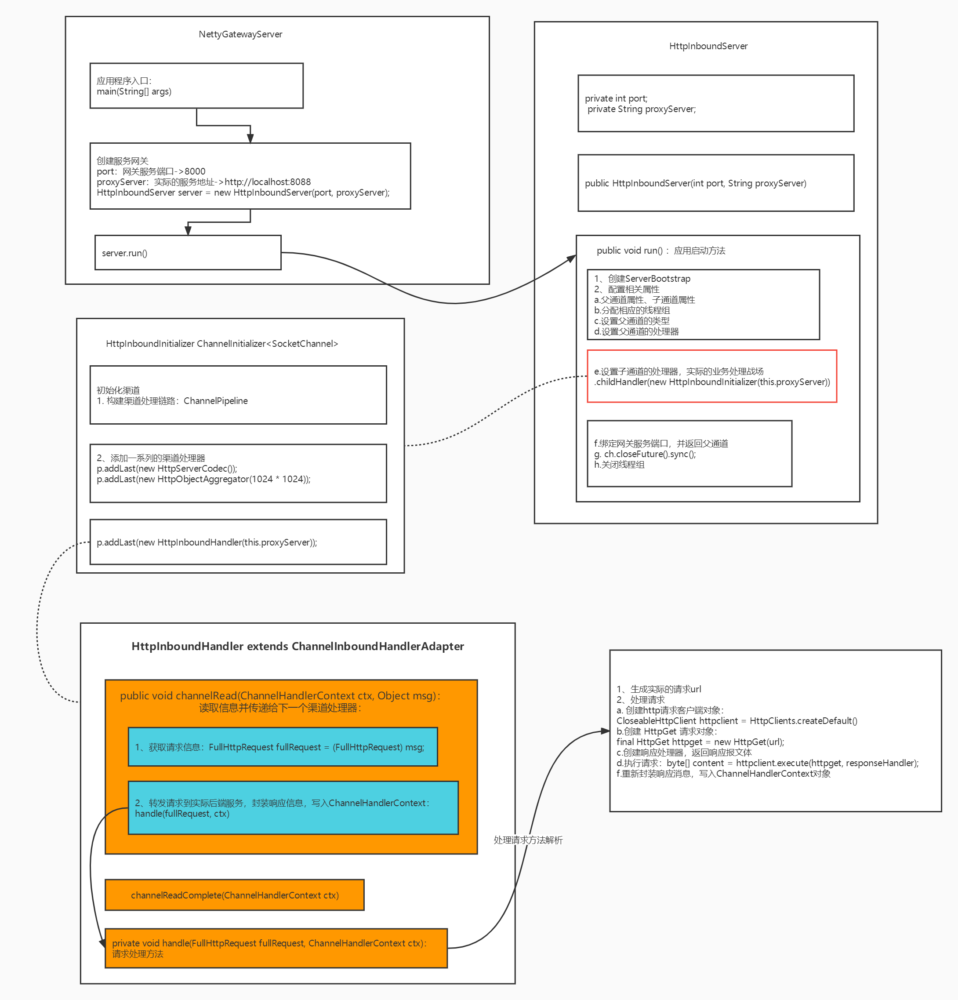
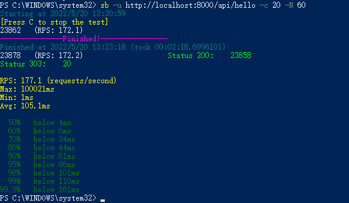
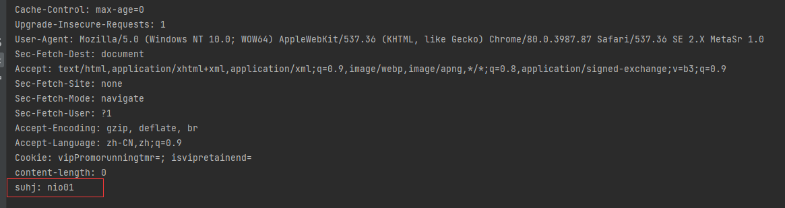

# Week03（20220522） 作业题目

## 1.（必做）整合你上次作业的 httpclient/okhttp。

### 1）环境准备

a. pom.xml 

```xml
    <dependencies>
        <dependency>
            <groupId>io.netty</groupId>
            <artifactId>netty-all</artifactId>
            <version>4.1.45.Final</version>
        </dependency>
        <dependency>
            <groupId>org.apache.httpcomponents.client5</groupId>
            <artifactId>httpclient5</artifactId>
            <version>5.1.1</version>
        </dependency>
    </dependencies>
```

### 2）代码整体逻辑

```
1. Netty作为网关，代理地址为：http://localhost:8000/
2. Netty 以主从Reactor多线程模式运行，其中主Reactor负责与请求客户端连接，从Reactor负责业务处理：即转发客户端请求到后端实际服务，接收响应后写回ChannelContext对象里，将响应内容返回客户端。
```

### 3）需要搞清楚的概念

```
一、ServerBootstrap或Bootstrap的配置与启动
1. EventLoopGroup：设置实际干活的线程组，无论是在处理与客户端请求的连接，还是处理channel中接收到的数据
2. ServerBootstrap：BootStrap在Netty的应用中负责引导服务器和客户端。Netty包含了两种不同类型的引导：
    a. 使用服务器的ServerBootstrap，用于接收客户端的连接以及为已接收的连接创建子通道。
    b. 用于客户端的BootStrap，不接受新的连接，并且是在父通道类完成一些操作。
3.ServerBootstrap中的方法
    a.group(bossGroup, workerGroup):设置在父通道和子通道干活的线程组，bossGroup和workerGroup由NioEventLoopGroup创建；
    b.channel(NioServerSocketChannel.class):设置父通道的Class属性，通过反射来实例化NioServerSocketChannel.class；
    c.handler(new LoggingHandler(LogLevel.DEBUG)):设置父通道中的处理器；
    d.childHandler(new HttpInboundInitializer(this.proxyServer)):设置子通道中的处理器，处理客户端的请求的channel的IO；一般都用			ChannelInitializer这个类的实例或则继承自这个类的实例。这里是业务开发的主战场。
    e.option(ChannelOption.SO_BACKLOG, 128)：这个变量主要是设置TCP连接中的一些可选项,而且这些属性是作用于每一个连接到服务器被创建的channel；
    d.childOption(ChannelOption.TCP_NODELAY, true):这个函数功能与option()函数几乎一样，唯一的区别是该属性设定只作用于被acceptor(也就是		boss EventLoopGroup)接收之后的channel。
4.以上配置完毕之后，就该启动应用啦：Channel ch = b.bind(port).sync().channel();
二、构建子通道中的处理器：HttpInboundInitializer
1. 继承 ChannelInitializer<SocketChannel>；
2. 重写方法：public void initChannel(SocketChannel ch)
    a. 构建ChannelPipeline对象
    b. 添加需要的inbound处理器，inbound处理器需要继承ChannelInboundHandlerAdapter，并重写方法
    	public void channelRead(ChannelHandlerContext ctx, Object msg) ：处理构建ChannelPipeline中的信息，并传递到下一个Handler
    	public void channelReadComplete(ChannelHandlerContext ctx):只要底层的SockerChannel读到了ByteBuf，就会触发一次调用，对于一个完		  整的业务消息，可能会多次调用
三、理解ChannelHandlerContext

参考：
https://www.jianshu.com/go-wild?ac=2&url=https%3A%2F%2Fwww.cnblogs.com%2Fjava-chen-hao%2Fp%2F11459808.html
https://www.jianshu.com/p/85667a891235
```

### 4）代码执行流程图

> 项目代码见：netty-gateway-demo



### 5）测试

#### 业务响应结果

> 正常返回后端响应消息


#### 压测结果

> 问题1：RPS: 177.1 (requests/second)   -> 请求处理量明细少
>
> 问题2：Max: 100021ms                           ->存在慢请求
>
> 问题3：平均响应速度不够快，有10%的请求需要在61ms以上
>
>   90%   below 61ms
>  		 95%   below 86ms
>  		 98%   below 101ms
>   		99%   below 110ms
> 		  99.9%   below 161ms



#### 后端日志输出情况

> 常报 `java.net.BindException: Address already in use: connect`  ，详见 log\netty-gateway-demo.txt

```shell
"D:\Program Files\Java\jdk1.8.0_202\bin\java.exe" "-javaagent:D:\Program Files\JetBrains\ideaIU-2021.2.3.win\lib\idea_rt.jar=55661:D:\Program Files\JetBrains\ideaIU-2021.2.3.win\bin" -Dfile.encoding=UTF-8 -classpath "D:\Program Files\Java\jdk1.8.0_202\jre\lib\charsets.jar;D:\Program Files\Java\jdk1.8.0_202\jre\lib\deploy.jar;D:\Program Files\Java\jdk1.8.0_202\jre\lib\ext\access-bridge-64.jar;D:\Program Files\Java\jdk1.8.0_202\jre\lib\ext\cldrdata.jar;D:\Program Files\Java\jdk1.8.0_202\jre\lib\ext\dnsns.jar;D:\Program Files\Java\jdk1.8.0_202\jre\lib\ext\jaccess.jar;D:\Program Files\Java\jdk1.8.0_202\jre\lib\ext\jfxrt.jar;D:\Program Files\Java\jdk1.8.0_202\jre\lib\ext\localedata.jar;D:\Program Files\Java\jdk1.8.0_202\jre\lib\ext\nashorn.jar;D:\Program Files\Java\jdk1.8.0_202\jre\lib\ext\sunec.jar;D:\Program Files\Java\jdk1.8.0_202\jre\lib\ext\sunjce_provider.jar;D:\Program Files\Java\jdk1.8.0_202\jre\lib\ext\sunmscapi.jar;D:\Program Files\Java\jdk1.8.0_202\jre\lib\ext\sunpkcs11.jar;D:\Program Files\Java\jdk1.8.0_202\jre\lib\ext\zipfs.jar;D:\Program Files\Java\jdk1.8.0_202\jre\lib\javaws.jar;D:\Program Files\Java\jdk1.8.0_202\jre\lib\jce.jar;D:\Program Files\Java\jdk1.8.0_202\jre\lib\jfr.jar;D:\Program Files\Java\jdk1.8.0_202\jre\lib\jfxswt.jar;D:\Program Files\Java\jdk1.8.0_202\jre\lib\jsse.jar;D:\Program Files\Java\jdk1.8.0_202\jre\lib\management-agent.jar;D:\Program Files\Java\jdk1.8.0_202\jre\lib\plugin.jar;D:\Program Files\Java\jdk1.8.0_202\jre\lib\resources.jar;D:\Program Files\Java\jdk1.8.0_202\jre\lib\rt.jar;D:\Java 训练营\jike java\week03\netty-gateway-demo\target\classes;D:\Program Files\maven\Bundle Maven 3\.m2\repository\io\netty\netty-all\4.1.45.Final\netty-all-4.1.45.Final.jar;D:\Program Files\maven\Bundle Maven 3\.m2\repository\org\apache\httpcomponents\client5\httpclient5\5.1.1\httpclient5-5.1.1.jar;D:\Program Files\maven\Bundle Maven 3\.m2\repository\org\apache\httpcomponents\core5\httpcore5\5.1.2\httpcore5-5.1.2.jar;D:\Program Files\maven\Bundle Maven 3\.m2\repository\org\apache\httpcomponents\core5\httpcore5-h2\5.1.2\httpcore5-h2-5.1.2.jar;D:\Program Files\maven\Bundle Maven 3\.m2\repository\org\slf4j\slf4j-api\1.7.25\slf4j-api-1.7.25.jar;D:\Program Files\maven\Bundle Maven 3\.m2\repository\commons-codec\commons-codec\1.15\commons-codec-1.15.jar" com.suhj.netty.NettyGatewayServer
NettyGateway 1.0.0 starting...
NettyGateway 1.0.0 started at http://localhost:8000 for server:com.suhj.netty.inbound.HttpInboundServer@60e53b93
SLF4J: Failed to load class "org.slf4j.impl.StaticLoggerBinder".
SLF4J: Defaulting to no-operation (NOP) logger implementation
SLF4J: See http://www.slf4j.org/codes.html#StaticLoggerBinder for further details.
开启netty http服务器，监听地址和端口为 http://127.0.0.1:8000/
java.net.BindException: Address already in use: connect
	at java.net.DualStackPlainSocketImpl.waitForConnect(Native Method)
	at java.net.DualStackPlainSocketImpl.socketConnect(DualStackPlainSocketImpl.java:85)
	at java.net.AbstractPlainSocketImpl.doConnect(AbstractPlainSocketImpl.java:350)
 
```

### 6）问题分析

> 原因在于windows默认的TCP/IP端口只有1024-5000个，而且释放的话大概需要4分钟才能够将之前占用的端口释放掉，导致当jmeter请求达到一定数量时提示上述错误
>
> 参考：https://www.baidu.com/link?url=d2H0l4XCI72p9hXYMT6TWZntfoO8yu9TslKdlg7_hl5QyrvSiJqrN2unfSbg2sZOC-e2S9jInDrSiSw0mV5gWi88W3GT--6DHJhQbJWl05W&wd=&eqid=8d00a9ed00002298000000066287532a

### 7）解决方案

> 还需要去调用 Apache Httpclient 的 API

## 2.（选做）使用 Netty 实现后端 HTTP 访问（代替上一步骤）。

## 3.（必做）实现过滤器。

### 0）知识补充：为啥需要过滤器

> 从图中很明显可以看出，在请求后端服务前后都需要经过Filter，于是乎Filter的作用就明确了，在PreFilter(请求前处理)可以做参数校验、流量监控、日志记录、修改请求内容等等，在PostFilter(请求后处理)可以做响应内容修改。
>
> 参考：https://zhuanlan.zhihu.com/p/430521138 《服务网关之过滤器》

### 1）添加请求头过滤器

```java
// 1.定义接口
public interface HttpRequestFilter {
    void filter(FullHttpRequest fullRequest, ChannelHandlerContext ctx);
}
// 2.实现接口
public class HeaderHttpRequestFilter implements HttpRequestFilter {
    @Override
    public void filter(FullHttpRequest fullRequest, ChannelHandlerContext ctx) {
        fullRequest.headers().set("suhj", "nio01");
    }
}
```

### 2）改造 HttpInboundHandler

```java
// 1. HttpInboundHandler添加成员变量
private HttpRequestFilter filter = new HeaderHttpRequestFilter();
// 2. 改造handle 方法
private void handle(FullHttpRequest fullRequest, ChannelHandlerContext ctx, HttpRequestFilter filter) {
        .......................................
        .......................................
        //添加请求过滤器
        filter.filter(fullRequest, ctx);
        .......................................
        .......................................
        .......................................
}
```

### 3）测试结果

在Netty网关封装的请求如下




## 4.（选做）实现路由。

## 5.（选做）跑一跑课上的各个例子，加深对多线程的理解。

## 6.（选做）完善网关的例子，试着调整其中的线程池参数。