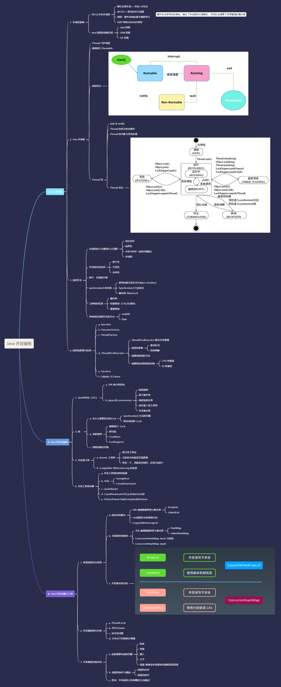

# 1.（选做）把示例代码，运行一遍，思考课上相关的问题。也可以做一些比较。


# 2.（必做）思考有多少种方式，在 main 函数启动一个新线程，运行一个方法，拿到这个方法的返回值后，退出主线程? 写出你的方法，越多越好，提交到 GitHub。
> 一个简单的代码参考: [ https://github.com/kimmking/JavaCourseCodes/tree/main/03concurrency/0301 ](https://github.com/kimmking/JavaCourseCodes/tree/main/03concurrency/0301)/src/main/java/java0/conc0303/Homework03.java

> 作业代码详见：https://github.com/suhj622/JikeJava/tree/master/week04/asyn-fetch-calculation/src/single_thread/Main.java

## 实验说明：

试验用单线程，异步计算，阻塞获取结果的方式。

## 准备0-1：需要线程异步计算的方法 - sum()

```java
    private static int sum() {
        return fibo(36);
    }

    private static int fibo(int a) {
        if ( a < 2)
            return 1;
        return fibo(a-1) + fibo(a-2);
    }
```

## 准备0-2：需要自定义的成员变量和方法

```java
    public static Object lock = new Object();
    public static ReentrantLock reentrantLock = new ReentrantLock();
    public static Condition condition = reentrantLock.newCondition();
    public static Semaphore semaphore = new Semaphore(1);
    
    public static void getLock(){
        synchronized (lock){
            System.out.println("主线程获取锁了！可以获取答案了。");
        }
    }

```

> 以下方法均在 `public void main(string[] args)` 中执行

## 方法1：使用FutureTask 异步计算-阻塞获取

```java
        System.out.println("====================================================================");
        System.out.println("1. 使用FutureTask 异步计算-阻塞获取");
        FutureTask<Integer> futureTask = new FutureTask<>(()->sum());
        new Thread(futureTask).start();
        System.out.println(futureTask.get());
```

## 方法2：使用CompeletableFuture 异步计算-阻塞获取

```java
        System.out.println("====================================================================");
		System.out.println("2. 使用CompeletableFuture 异步计算-阻塞获取");
        CompletableFuture<Integer> completableFuture = CompletableFuture.supplyAsync(()->sum());
        //CompletableFuture<Integer> completableFuture = CompletableFuture.supplyAsync(()->sum(), Executors.newSingleThreadExecutor()); //该语句会造成死锁 以后再研究
        System.out.println(completableFuture.get());
```

## 方法3：继承Thread类，使用join同步获取

```java
        System.out.println("====================================================================");
        System.out.println("3. 继承Thread类，使用join同步获取");
        MyThread1 t1 = new MyThread1();
        t1.start();
        t1.join();
        System.out.println(t1.get());
```

```java
    static final class MyThread1 extends Thread  {
        volatile int result;

        @Override
        public void run() {
            result = sum();
        }

        public int get(){
            return result;
        }
    }
```

## 方法4：synchronized + 自旋 

```java
        System.out.println("====================================================================");
        System.out.println("4-1. synchronized + 自旋 思路 - 继承Thread类，保证计算子线程优先执行，主线程成功获取锁之后，输出结果，并退出");
        MyThread2_1 t2 = new MyThread2_1();
        t2.start();
        while (!(t2.isAlive() && t2.isRun)){
            System.out.println("子线程t2还未启动，等待10毫秒......");
            Thread.sleep(10);
        }
        getLock();
        System.out.println(t2.get());
```

```java
    static final class MyThread2_1 extends Thread  {
        volatile int result;
        volatile boolean isRun;

        @Override
        public void run() {
            synchronized (lock){
                isRun = true;
                result = sum();
            }
        }

        public int get(){
            return result;
        }
    }
```

## 方法5：synchronized + 等待

```java
        System.out.println("====================================================================");
        System.out.println("4-2. synchronized + 等待 思路 - 继承Thread类，保证计算子线程优先执行，主线程成功获取锁之后，输出结果，并退出");
        MyThread2_2 t2_2 = new MyThread2_2();
        t2_2.start();
        while (!t2_2.isCompleted){
            synchronized (lock){
                lock.wait();
            }
        }
        System.out.println(t2_2.get());
```

```java
    static final class MyThread2_2 extends Thread  {
        volatile int result;
        volatile boolean isCompleted;

        @Override
        public void run() {
            synchronized (lock){
                try{
                    result = sum();
                    isCompleted = true;
                }finally {
                    lock.notify();
                }

            }
        }

        public int get(){
            return result;
        }
    }
```

## 方法6：countDownLatch思路

```java
        System.out.println("====================================================================");
        System.out.println("5. countDownLatch思路-继承Thread类");
        CountDownLatch countDownLatch = new CountDownLatch(1);
        MyThread3 t3 = new MyThread3(countDownLatch);
        t3.start();
        countDownLatch.await();
        System.out.println(t3.get());
```

```java
    static final class MyThread3 extends Thread  {
        private CountDownLatch countDownLatch;
        volatile int result;

        public MyThread3(CountDownLatch countDownLatch){
            this.countDownLatch = countDownLatch;
        }


        @Override
        public void run() {
            result = sum();
            countDownLatch.countDown();
        }

        public int get(){
            return result;
        }
    }
```

## 方法7：CyclicBarrier思路

```java
        System.out.println("====================================================================");
        System.out.println("6. CyclicBarrier思路-继承Thread类");
        CyclicBarrier cyclicBarrier = new CyclicBarrier(2);
        MyThread4 t4 = new MyThread4(cyclicBarrier);
        t4.start();
        cyclicBarrier.await();
        System.out.println(t4.get());
```

```java
    static final class MyThread4 extends Thread  {
        private CyclicBarrier cyclicBarrier;
        volatile int result;

        public MyThread4(CyclicBarrier cyclicBarrier){
            this.cyclicBarrier = cyclicBarrier;
        }


        @Override
        public void run() {
            try{
                result = sum();
            }finally {
                try {
                    cyclicBarrier.await();
                } catch (InterruptedException e) {
                    e.printStackTrace();
                } catch (BrokenBarrierException e) {
                    e.printStackTrace();
                }
            }

        }

        public int get(){
            return result;
        }
    }
```

## 方法8：ReentrantLock + Condition 思路

```java
        System.out.println("====================================================================");
        System.out.println("7. ReentrantLock + Condition 思路-继承Thread类");
        MyThread5 t5 = new MyThread5(reentrantLock,condition);
        t5.start();
        reentrantLock.lock();
        if (!t5.isCompleted) condition.await();
        reentrantLock.unlock();
        System.out.println(t5.get());
```

```java
    static final class MyThread5 extends Thread  {
        private ReentrantLock lock;
        private Condition condition;
        volatile int result;
        volatile boolean isCompleted;

        public MyThread5(ReentrantLock lock, Condition condition){
            this.lock = lock;
            this.condition = condition;
        }


        @Override
        public void run() {
            try {
                lock.lock();
                result = sum();
                condition.signal();
                lock.unlock();
            }finally {
                isCompleted = true;
            }
        }

        public int get(){
            return result;
        }
    }
```

## 方法9：Semaphore 思路

```java
        System.out.println("====================================================================");
        System.out.println("8. Semaphore 思路 - 继承Thread");
        MyThread6 t6 = new MyThread6(semaphore);
        t6.start();
        while (!t6.isCompleted){
            semaphore.acquireUninterruptibly();
            semaphore.release();
        }
        System.out.println(t6.get());
```

```java
    static final class MyThread6 extends Thread  {
        private Semaphore semaphore;
        volatile int result;
        volatile boolean isCompleted;

        public MyThread6(Semaphore semaphore){
            this.semaphore = semaphore;
        }


        @Override
        public void run() {
            try {
                semaphore.acquireUninterruptibly();
                result = sum();
                isCompleted = true;
            }finally {
                semaphore.release();
            }
        }

        public int get(){
            return result;
        }
    }
```

## 方法10：LockSupport 思路

```java
        System.out.println("====================================================================");
        System.out.println("9. LockSupport 思路 - 继承Thread");
        MyThread7 t7 = new MyThread7(Thread.currentThread());
        t7.start();
        while (!t7.isCompleted){
            LockSupport.park();
        }
        System.out.println(t7.get());
```

```java
    static final class MyThread7 extends Thread  {
        volatile int result;
        volatile boolean isCompleted;
        private Thread waiter;

        public MyThread7(Thread waiter){
            this.waiter = waiter;
        }


        @Override
        public void run() {
            try {
                result = sum();
                isCompleted = true;
            }finally {
                LockSupport.unpark(waiter);
            }


        }

        public int get(){
            return result;
        }
    }
```

## 方法11：自旋思路

```java
        System.out.println("====================================================================");
        System.out.println("10. 自旋思路 - 继承Thread");
        MyThread8 t8 = new MyThread8();
        t8.start();
        while (!t8.isCompleted){
            System.out.println("子线程t8还未执行完成，等待10毫秒...");
            Thread.sleep(10);
        }
        System.out.println(t8.get());
```

```java
    static final class MyThread8 extends Thread  {
        volatile int result;
        volatile boolean isCompleted;


        @Override
        public void run() {
            result = sum();
            isCompleted = true;
        }

        public int get(){
            return result;
        }
    }
```

## 测试结果

> 均能正常获取结果

```java
====================================================================
1. 使用FutureTask 异步计算-阻塞获取
24157817
====================================================================
2. 使用CompeletableFuture 异步计算-阻塞获取
24157817
====================================================================
3. 继承Thread类，使用join同步获取
24157817
====================================================================
4-1. synchronized + 自旋 思路 - 继承Thread类，保证计算子线程优先执行，主线程成功获取锁之后，输出结果，并退出
子线程t2还未启动，等待10毫秒......
主线程获取锁了！可以获取答案了。
24157817
====================================================================
4-2. synchronized + 等待 思路 - 继承Thread类，保证计算子线程优先执行，主线程成功获取锁之后，输出结果，并退出
24157817
====================================================================
5. countDownLatch思路-继承Thread类
24157817
====================================================================
6. CyclicBarrier思路-继承Thread类
24157817
====================================================================
7. ReentrantLock + Condition 思路-继承Thread类
24157817
====================================================================
8. Semaphore 思路 - 继承Thread
24157817
====================================================================
9. LockSupport 思路 - 继承Thread
24157817
====================================================================
10. 自旋思路 - 继承Thread
子线程t8还未执行完成，等待10毫秒...
子线程t8还未执行完成，等待10毫秒...
子线程t8还未执行完成，等待10毫秒...
子线程t8还未执行完成，等待10毫秒...
子线程t8还未执行完成，等待10毫秒...
24157817

```

注意：虽说本次实验实现的方式多种多样，但只是为了验证所学知识。在现实业务场景下，应结合实际情况采取最优策略。

# 3.（选做）列举常用的并发操作 API 和工具类，简单分析其使用场景和优缺点。


# 4.（选做）请思考: 什么是并发? 什么是高并发? 实现高并发高可用系统需要考虑哪些 因素，对于这些你是怎么理解的?


# 5.（选做）请思考: 还有哪些跟并发类似 / 有关的场景和问题，有哪些可以借鉴的解决 办法。


# 6.（必做）把多线程和并发相关知识梳理一遍，画一个脑图，截图上传到 GitHub 上。 可选工具:xmind，百度脑图，wps，MindManage，或其他。

> 知识树详见：https://github.com/suhj622/JikeJava/blob/master/week04/Java%20%E5%B9%B6%E5%8F%91%E7%BC%96%E7%A8%8B%EF%BC%88%E7%AC%94%E8%AE%B0-%E5%A4%A7%E7%BA%B2%EF%BC%89%20.jpg
>
> 详细笔记见：https://github.com/suhj622/JikeJava/blob/master/week04/Java%20%E5%B9%B6%E5%8F%91%E7%BC%96%E7%A8%8B%EF%BC%88%E7%AC%94%E8%AE%B0%EF%BC%89.md

