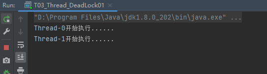

# Java 多线程

## 1. 多线程基础

### 为什么会有多线程？

- 摩尔定律失效-> 多核+分布式

  本质原因是摩尔定律失效-> 多核+分布式时代的来临。

- 多CPU=>更多的并行资源

- 线程：操作系统的基本调度单元

- SMP 架构与NUMA架构

  SMP 架构——共享内存架构：所有的CPU都共享一块内存，竞争激烈

  NUMA架构——非一致性内存访问架构：将CPU分组，每一组CPU共享一块内存，分区分治思想，可扩展，减少竞争

  

总结：硬件多任务架构的演进，催生了多线程的处理模式，但同时也提高了资源管理的复杂度

### Java 线程的创建过程

Java 层面：创建线程，启动线程（start）。

JVM 层面：JVM调用操作系统创建线程的API，将JVM层面的线程映射到OS层面的线程，进而管理操作系统线程的生命周期；需要为线程分配 JVM 栈、相关的内存，准备好了就启动操作系统的线程，去执行run方法中的逻辑；执行完毕之后，终结这个操作系统的线程。

OS 层面：响应JVM层面的线程对象，创建系统线程->启动->终结

当 Java 层面执行 start() 方法时，JVM 层面才会真正地去调用操作系统 API 去创建一个线程。如果不执行 start() 方法而直接执行 run() 方法的话，实际上跟多线程没有关系，只是在主线程里执行了 run() 方法里的代码逻辑。

当run方法执行完毕后，JVM层面的线程和操作系统层面的线程的生命周期就结束了。


思考一下：线程与进程的区别是什么？

进程应用启动、资源管理的基本单位；线程是操作系统运行的基本单位，进程里的线程可以共享进程空间里的各项资源如内存。

不同进程之间的资源是隔离。

在现代操作系统里，线程与进程的概念越来越模糊，现在的应用程序有很多都是多进程的，在 Linux 系统上，线程可以看作轻量级的进程。

## 2. Java 多线程

### 守护线程

守护线程的唯一用途是为其他线程提供服务。

计时器线程就是一个例子，它定时地发送“计时器嘀嗒”信号给其他线程，另外清空过时缓存项的线程也是守护线程，JVM 进程中的 GC 线程也是守护线程。

退出：当只剩下守护线程时，虚拟机就会退出。因为如果只剩下守护线程，就没必要继续运行程序了。

- 示例代码——`week04/multithread-demo/src/com/suhj/T00_create_thread/T00_Create_Daemon_Thread.java`

  ```java
  package com.suhj.T00_create_thread;
  
  public class T00_Create_Daemon_Thread {
      public static void main(String[] args) {
          Runnable task = new Runnable() {
              @Override
              public void run() {
                  try {
                      Thread.sleep(5000);
                  } catch (InterruptedException e) {
                      e.printStackTrace();
                  }
                  Thread t = Thread.currentThread();
                  System.out.println("当前线程:" + t.getName());
              }
          };
          Thread thread = new Thread(task);
          thread.setName("test-thread-1");
          thread.setDaemon(true);
          thread.start();
      }
  }
  ```

  执行结果：子线程中的`System.out.println("当前线程:" + t.getName())`没有被执行，原因就是主线程已经提前退出了，进程也随之销毁了。

  

### Runnable

任何线程类 Thread 必须实现的接口，其中重写 run() 方法作为线程启动后执行的逻辑片段；start() 方法作为创建新线程的入口。

- 接口定义——JDK 8 源码

  ```java
  @FunctionalInterface
  public interface Runnable {
      public abstract void run();
  }
  ```

- 实现——JDK 8 源码

  ```java
  public
  class Thread implements Runnable {
       .....
  ```

- 示例：

  ```java
  // 示例1
  Runnable task = new Runnable() {
      @Override
      public void run() {
      	System.out.println("业务逻辑...");
      }
  };
  
  // 示例2
  public class XXXTask implements Runnable {
      @Override
      public void run() {
      	System.out.println("执行逻辑...");
      }
  }
  ```

  

### 线程状态

1. New（新建）：还没开始运行。

2. Runnable（可运行）：调用start()方法后，可能正在运行——RUNNING（获得CPU时间片），也可能没有运行——READY（没有获得CPU时间片）。

3. Blocked（阻塞）：当一个线程试图获取一个内部的对象锁，而这个锁目前正被其他线程占有，该线程就会阻塞。当所有其他线程都释放了这个锁，并且线程调度器运行该线程持有这个锁时，它将变成非阻塞状态。

4. Waiting（等待）：当线程等待另一个线程通知调度器出现一个条件时，这个线程就会进入等待状态。需要其他线程唤醒。

5. Timed waiting（计时等待）：线程进入计时等待状态，这一状态将一直保持到超时期满或者接收到适当的通知。

6. Terminated（终止）：

   线程会终止的两个原因：

   - run方法正常退出；
   - 没有捕获的异常终止了run方法，使线程意外终止。


### Thread

Java 层面的线程类。

#### Thread 类的重要属性/方法

| 重要属性/方法                          | 说明                                   |
| -------------------------------------- | -------------------------------------- |
| volatile String name;                  | 线程名称– 诊断分析使用                 |
| boolean daemon = false;                | 后台守护线程标志– 决定JVM优雅关闭      |
| Runnable target;                       | 任务(只能通过构造函数传入)             |
| synchronized void start()              | 【协作】启动新线程并自动执行           |
| void join()                            | 【协作】等待某个线程执行完毕（来汇合） |
| static native Thread currentThread();  | 静态方法: 获取当前线程信息             |
| static native void sleep(long millis); | 静态方法: 线程睡眠并让出CPU时间片      |

#### wait & notify

| Object#方法                        | 说明                                                         |
| ---------------------------------- | ------------------------------------------------------------ |
| void wait()                        | 放弃锁+等待0ms+尝试获取锁;                                   |
| void wait(long timeout, int nanos) | 放弃锁+ wait + 到时间自动唤醒/中途唤醒   (精度: nanos>0 则 timeout++) |
| native void wait(long timeout)     | 放弃锁+ wait + 到时间自动唤醒/中途被唤醒  (唤醒之后需要自动获取锁) |
| native void notify()               | 发送信号通知1个等待线程                                      |
| native void notifyAll()            | 发送信号通知所有等待线程                                     |

如何理解 Thread.sleep 与 Object#wait？

> 这两者的施加者是有本质区别的. 
> sleep()是让某个线程暂停运行一段时间,其控制范围是由当前线程决定,也就是说,在线程里面决定.好比如说,我要做的事情是 "点火->烧水->煮面",而当我点完火之后我不立即烧水,我要休息一段时间再烧.对于运行的主动权是由我的流程来控制.
>
> 而wait(),首先,这是由某个确定的对象来调用的,将这个对象理解成一个传话的人,当这个人在某个线程里面说"暂停!",也是 thisOBJ.wait(),这里的暂停是阻塞,还是"点火->烧水->煮饭",thisOBJ就好比一个监督我的人站在我旁边,本来该线 程应该执行1后执行2,再执行3,而在2处被那个对象喊暂停,那么我就会一直等在这里而不执行3,但正个流程并没有结束,我一直想去煮饭,但还没被允许, 直到那个对象在某个地方说"通知暂停的线程启动!",也就是thisOBJ.notify()的时候,那么我就可以煮饭了,这个被暂停的线程就会从暂停处 继续执行.
>
> 其实两者都可以让线程暂停一段时间,但是本质的区别是一个线程的运行状态控制,一个是线程之间的通讯的问题
>
> https://blog.csdn.net/suifeng629/article/details/95496631
>
> https://blog.csdn.net/selftaught0424/article/details/112727328

线程sleep之后，仍然拥有对同步块的控制权，如果在同步块中执行sleep，其他线程仍然无法获得执行权限；线程wait之后，会释放锁，其他线程就会获得同步块的执行权限。

##### 执行 sleep() 之后仍然持有锁的示例

> `week04/multithread-demo/src/com/suhj/T00_create_thread/T01_Thread_Sleep_Not_Release_Lock.java`

```java
package com.suhj.T00_create_thread;

/**
 * 测试线程在同步块中sleep之后是否会释放锁
 */
public class T01_Thread_Sleep_Not_Release_Lock {

    Runnable target = () ->{
        synchronized (this){
            System.out.println( Thread.currentThread().getName()+ "开始执行......");
            try {
                Thread.sleep(1000);
            } catch (InterruptedException e) {
                e.printStackTrace();
            }
            System.out.println(Thread.currentThread().getName()+ "结束执行......");
        }
    };

    public static void main(String[] args) {
        T01_Thread_Sleep_Not_Release_Lock test = new T01_Thread_Sleep_Not_Release_Lock();
        Runnable target = test.target;
        new Thread(target).start();
        new Thread(target).start();
    }
}

```


分析：Thread-0 执行 `Thread.sleep(1000);` 之后，仍然持有 this 对象的内部锁，同步代码块的控制权仍然在 Thread-0，所以等到 sleep 结束之后，会继续运行同步代码块内的代码。退出同步代码块之后，由线程调度器调度 Thread-1 线程运行。

但如果，有其他线程（不必持有this对象的锁），在 Thread-0 sleep 期间，大概率可以获取到 CPU 时间片进入 running 状态。

##### 执行 wait() 之后释放锁的示例

> `week04/multithread-demo/src/com/suhj/T00_create_thread/T02_Thread_Wait_Release_Lock.java`

```java
package com.suhj.T00_create_thread;

/**
 * 测试 Thread执行 wait() 方法是否会释放锁
 * @Author:suhj
 */
public class T02_Thread_Wait_Release_Lock {

    Object lock = new Object();

    Runnable target = () ->{
        synchronized (lock){
            System.out.println( Thread.currentThread().getName()+ "开始执行......");
            try {
                lock.wait(1000);
            } catch (InterruptedException e) {
                e.printStackTrace();
            }
            System.out.println(Thread.currentThread().getName()+ "结束执行......");
        }
     };

    public static void main(String[] args) {
        T02_Thread_Wait_Release_Lock test = new T02_Thread_Wait_Release_Lock();
        Runnable target = test.target;
        new Thread(target).start();
        new Thread(target).start();
    }
}

```

运行结果：


分析：Thread-0 执行 `lock.wait(1000)` 后，会释放持有的 lock 对象的内部锁，同时进入 Timed waiting 状态；所以，Thread-1有机会进入同步块执行`lock.wait(1000)` 。可以看到，此同步块中，Thread-0、Thread-1 是交替执行的，破坏了原子性的原则。

##### 两个线程执行 wait() 之后陷入等待的示例

> `week04/multithread-demo/src/com/suhj/T00_create_thread/T03_Thread_DeadLock01.java`

```java
package com.suhj.T00_create_thread;

/**
 * 测试 Thread执行 wait() 方法是否会释放锁
 * @Author:suhj
 */
public class T03_Thread_DeadLock01 {

    Object lock = new Object();

    Runnable target = () ->{
        synchronized (lock){
            System.out.println( Thread.currentThread().getName()+ "开始执行......");
            try {
                 lock.wait();
            } catch (InterruptedException e) {
                e.printStackTrace();
            }
             System.out.println(Thread.currentThread().getName()+ "结束执行......");
        }
     };


    public static void main(String[] args) throws Exception {
        T03_Thread_DeadLock01 test = new T03_Thread_DeadLock01();
        Runnable target = test.target;
         new Thread(target).start();
        new Thread(target).start();
      }
}
```

运行结果：



查看栈信息

> week04/log/T03_Thread_DeadLock01.log.txt


分析：Thread-0 和 Thread-1 同时失去了对 lock 对象锁的持有权，且同时在等待有其他线程进行唤醒，但由于没有其他线程，所以陷入等待锁的状态。

##### 进一步理解 wait() 和 wait(long timeout) 方法

线程中调用了 `lock.wait()`，需要等待其他线程进行唤醒，唤醒线程必须持有该锁；没有持有锁的线程去唤醒，会报如下异常 `IllegalMonitorStateException`。

线程中调用了 `lock.wait(timeout)`，唤醒条件为以下两者之一：1、等待其他线程进行唤醒；2、超时自动唤醒

#### Thread 的状态改变操作

##### 1. `Thread.sleep(long millis)`

进入 TIMED_WAITING 状态，不释放锁。

一定是当前线程调用此方法，当前线程进入TIMED_WAITING 状态，但不释放对象锁，millis 后线程自动苏醒进入就绪状态。

作用：给其它线程执行机会的最佳方式。

##### 2. `Thread.yield()`

进入 READY 状态，不释放锁。

一定是当前线程调用此方法，当前线程放弃获取的CPU 时间片，但不释放锁资源，由运行状态变为就绪状态，让OS 再次选择线程。

作用：让相同优先级的线程轮流执行，但并不保证一定会轮流执行。实际中无法保证 yield() 达到让步目的，因为让步的线程还有可能被线程调度程序再次选中。`Thread.yield()` 不会导致阻塞。该方法与 sleep() 类似，只是不能由用户指定暂停多长时间。

##### 3. `t.join()/t.join(long millis)`

当前线程 进入WAITING/TIMED_WAITING 状态，不释放锁。其他线程 t 内部调用了 t.wait，会释放 t 对象上的同步锁。

当前线程里调用其它线程t 的join 方法，当前线程进入WAITING/TIMED_WAITING 状态，当前线程不会释放已经持有的对象锁，因为内部调用了t.wait，所以会释放t这个对象上的同步锁。线程t 执行完毕或者millis 时间到，当前线程进入就绪状态。其中，wait 操作对应的notify 是由 jvm 底层的线程执行结束前触发的。

##### 4. `obj.wait()`

进入 WAITING 状态，释放锁。

当前线程调用对象的wait() 方法，当前线程释放obj 对象锁，进入等待队列。依靠 notify()/notifyAll() 唤醒或者wait(long timeout) timeout 时间到自动唤醒。唤醒会，线程恢复到wait 时的状态。

##### 5. `obj.notify()/notifyAll()` 

obj.notify() 唤醒在此对象监视器上等待的单个线程，选择是任意性的。notifyAll() 唤醒在此对象监视器上等待的所有线程。

#### Thread 的中断方法

以下的三个方法不知道有什么具体应用，先作为知识储备。

> https://blog.csdn.net/weixin_34406086/article/details/89572775

##### 1. `void interrupt()`

向线程发送请求中断。线程的中断状态被设置为true。如果当期该线程被一个 sleep 调用阻塞，则抛出一个 InterruptedException 异常。

interrupt() 并不能真正的中断线程，需要被调用的线程自己进行配合才行，在正常运行任务时，经常检查本线程的中断标志位，如果被设置了中断标志就自行停止线程。具体到底中断还是继续运行，应该由被通知的线程自己处理。

##### 2. `static boolean interrupted()`

测试当前线程（即正在执行这个指令的线程）是否被中断。它会将当前线程的中断状态重置为false。

##### 3. `boolean isInterrupted()`

测试线程是否被中断。与 static interrupted 方法不同，这个调用不改变线程的中断状态。

#### Thread 的中断与异常处理

1. 线程内部自己处理异常，不溢出到外层（Future 可以封装）。

2. 如果线程被Object.wait, Thread.join和Thread.sleep 三种方法之一阻塞，此时调用该线程的interrupt()方法，那么该线程将抛出一个InterruptedException 中断异常（该线程必须事先预备好处理此异常），从而提早地终结被阻塞状态。如果线程没有被阻塞，这时调用interrupt() 将不起作用，直到执行到wait/sleep/join 时，才马上会抛出InterruptedException。

3. 如果是计算密集型的操作怎么办？

   分段处理，每个片段检查一下状态，是不是要终止。（需要找到具体案例加深理解）

#### Thread 状态

1. 本线程主动操作
2. 被动：遇到锁；被通知

## 3. 线程安全

### 多线程执行会遇到什么问题？

- 竞态条件（race condition）

  多个线程竞争统一资源时，如果对资源的访问顺序敏感，就称竞态条件。

  > 在大多数实际的多线程应用中，两个或两个以上的线程需要共享对同一数据的存储。如果两个线程存储同一个对象，并且每个线程分别调用了一个修改该对象的方法，会发生什么呢？可以想到，这两个线程会相互覆盖。取决于线程访问数据的次序，可能会导致对象被破坏。这种情况通常被称为竞态条件。
  >
  > 为了避免多线程破坏共享数据，必须使用同步。同步：一个线程必须等待另外线程执行完毕，方可执行。这里线程的行为模式就跟同步阻塞式IO一样。

- 临界区

  导致竞态条件发生的代码区称作临界区。不进行恰当的控制，会导致线程安全问题

  > 涉及到共享资源，会破坏共享数据

- 共享与同步（线程间通信）

  

- 多线程

### 并发相关的性质

- 原子性：原子操作，注意跟事务ACID 里原子性的区别与联系

  对基本数据类型的变量的读取和赋值操作是原子性操作，即这些操作是不可被中断的，要么执行，要么不执行。

  

  只有语句1是原子操作。

  ```java
  x = 10;      //语句1
  y = x;       //语句2
  x++;         //语句3
  x = x + 1;   //语句4
  ```

  多个线程并发问题，类似于，多个事务的并发问题

  > Java 多线程开发里用锁保证原子性

- 可见性：对于可见性，Java 提供了volatile 关键字来保证可见性。

  当一个共享变量被volatile 修饰时，它会保证修改的值会立即被更新到主存，当有其他线程需要读取时，它会去内存中读取新值。

  另外，通过synchronized 和Lock 也能够保证可见性，synchronized 和Lock 能保证同一时刻只有一个线程获取锁然后执行同步代码，并且在释放锁之前会将对变量的修改刷新到主存当中。

  > 缓存一致性协议——MESI
  >
  > M：修改状态
  >
  > E：独占状态
  >
  > S：共享状态
  >
  > I：无效状态

  注意：volatile 并不能保证原子性。

- 有序性：Java 允许编译器和处理器对指令进行重排序，但是重排序过程不会影响到单线程程序的执行，却会影响到多线程并发执行的正确性。可以通过volatile 关键字来保证一定的“有序性”（synchronized 和Lock也可以）。

  > happens-before 原则（先行发生原则）：
  > 1. 程序次序规则：一个线程内，按照代码先后顺序
  > 2. 锁定规则：一个unLock 操作先行发生于后面对同一个锁的lock 操作
  > 3. Volatile 变量规则：对一个变量的写操作先行发生于后面对这个变量的读操作
  > 4. 传递规则：如果操作A 先行发生于操作B，而操作B 又先行发生于操作C，则可以得出A 先于C
  > 5. 线程启动规则：Thread 对象的start() 方法先行发生于此线程的每个一个动作
  > 6. 线程中断规则：对线程interrupt() 方法的调用先行发生于被中断线程的代码检测到中断事件的发生
  > 7. 线程终结规则：线程中所有的操作都先行发生于线程的终止检测，我们可以通过Thread.join() 方法结束、
  > Thread.isAlive() 的返回值手段检测到线程已经终止执行
  > 8. 对象终结规则：一个对象的初始化完成先行发生于他的finalize() 方法的开始

### 例子：多线程计数

> `week04/multithread-demo/src/com/suhj/T00_create_thread/T04_Thread_IPlusPlus.java`
>
> 100个线程计数，从0计数到1_000_000

```java
package com.suhj.T00_create_thread;

import java.util.concurrent.CountDownLatch;

/**
 * @author Haojie
 * @date 2022/5/24
 */
public class T04_Thread_IPlusPlus {
    private static long n = 0L;

    public static void main(String[] args) throws InterruptedException {
        Thread[] threads = new Thread[100];
        CountDownLatch latch = new CountDownLatch(threads.length);

        for(int i = 0; i < threads.length; i++) {
            threads[i] = new Thread(()->{
                for(int j = 0; j < 10000; j++) {
                    //当一个线程在执行n++这个操作时，不会被其他线程打断
                    //原子性：一系列操作要么全部执行完成，要么都不执行
                    synchronized(T04_Thread_IPlusPlus.class) {
                        n ++;
                    }
                }
                latch.countDown();
            });
        }

        for(Thread t:threads) {
            t.start();
        }

        latch.await();

        System.out.println(n);

    }
}

```

运行结果：


### synchronized

#### 锁的本质

> 实现线程对资源的访问控制，保证同一时间只能有一个线程去访问某一个资源。锁实际上充当了信号量的角色。想象一下，线程就是一个个游客，资源就是一个待参观的房子。这个房子同一时间只运行一个游客进去参观，当一个人出来后下一个人才能进去。而锁就是这个房子的守卫。
>
> 以下是线程、锁和资源三者关系示意图
>
> 
>
> 引自  Java并发实现原理|JDK源码剖析|（余春龙）p.6

#### 锁与共享资源（对象）

> 既然锁是一个对象，要访问的共享资源本身也是一个对象，这两个对象就可以合成一个对象。`synchronized(this) {...}`：我们要访问的共享资源是对象a，锁也是加在对象a上面的。当然，也可以另外新建一个对象，代码编程 `synchronized(obj1) {...}`。这个时候，访问的共享资源时对象a，而锁是加载新建的对象 obj1 上面的。
>
> 资源和锁合二为一，使得在 Java 里面，synchronized 关键字可以加在任何对象的成员上面。这意味着，这个对象既是共享资源，同时也具备“锁”的功能！
>
> 引自  Java并发实现原理|JDK源码剖析|（余春龙）p.7

#### synchronized 的实现原理

synchronized ，Java 中的同步块关键字，使用单独的锁对象，可以加在方法上，也可以加在一块代码块上，不管加在哪些地方，其实都是针对某个对象加锁，具体加锁是加在对象头里面具体的标志位上。

1. 使用对象头标记字(Object monitor)

   

   

2. Synchronized 方法优化

   三种使用 Synchronized 的方法：使用单独的锁对象，加在方法上，加上代码块上，区别是使用锁的粒度不同。

   - 同步代码块比同步方法的粒度小。只需要针对需要的代码加锁。
   - 锁分离。制造多把锁，提高并发的粒度。

3. 偏向锁: BiaseLock

### 几种锁的区别

偏向锁：原来持有锁的线程，在时间片耗尽后，多个线程进行锁的竞争，线程调度器还是倾向于把锁给原来已获得锁的线程。

轻量级锁：CAS锁、乐观锁、无锁机制。

重量级锁：系统检查到锁是重量级锁之后，会把等待想要获得锁的线程进行阻塞，被阻塞的线程不会消耗cpu。但是阻塞或者唤醒一个线程时，都需要操作系统来帮忙，这就需要从用户态转换到内核态，而转换状态是需要消耗很多时间的，有可能比用户执行代码的时间还要长。

### 锁的升级

synchronized关键字并非一开始就该对象加上重量级锁，也是从偏向锁，轻量级锁，再到重量级锁的过程。这个过程也告诉我们，假如我们一开始就知道某个同步代码块的竞争很激烈、很慢的话，那么我们一开始就应该使用重量级锁了，从而省掉一些锁转换的开销。

### 其他保证线程安全的方式

#### volatile

> 只能保证可见性，不能保证原子性。

1. 每次读取都强制从主内存刷数据。

2. 适用场景： 单个线程写；多个线程读

3. 原则： 能不用就不用，不确定的时候也不用

4. 替代方案： Atomic 原子操作类

   

   那么，语句1和2，不会被重排到3的后面，4和5也不会到前面。
   同时可以保证1和2的结果是对3、4、5可见。

#### final

1. final 关键字的作用

   | final 定义类型    | 说明                                                         |
   | ----------------- | ------------------------------------------------------------ |
   | final class XXX   | 不允许继承                                                   |
   | final 方法        | 不允许Override                                               |
   | final 局部变量    | 不允许修改                                                   |
   | final 实例属性    | 构造函数/初始化块/<init>之后不允许变更；<br />只能赋值一次；<br />安全发布: 构造函数结束返回时，final 域最新的值被保证对其他线程可见 |
   | final static 属性 | <clinit>静态块执行后不允许变更；<br />只能赋值一次           |

2. 思考：final 声明的引用类型与原生类型在处理时有什么区别?

   final 声明的引用类型变量不能修改，但引用所指向的实例数据可以修改。

3. 建议：Java 里的常量替换。写代码最大化用final 是个好习惯。

## 4. 线程池原理与应用

### 线程池原理

构造一个新的线程开销有些大；

如果你的程序中创建了大量的生命期很短的线程，那么不应该把每个任务映射到一个单独的线程，而应用使用线程池（thread pool）。线程池包含许多准备运行的线程。

为线程池提供一个Runnable，就会有一个线程调用run方法。

当run方法退出时，这个线程不会死亡，而是留在池中准备为下一个请求提供服务。


### Executor

> 执行者，顶层接口。

| 重要方法                        | 说明             |
| ------------------------------- | ---------------- |
| void execute(Runnable command); | 执行可运行的任务 |

线程池从功能上看，就是一个任务执行器。

submit 方法-> 有返回值，用Future 封装

execute 方法-> 无返回值

submit 方法还异常可以在主线程中get 捕获到

execute 方法执行任务是捕捉不到异常的


### ExecutorService

> 接口API。

| 重要方法                                       | 说明                                     |
| ---------------------------------------------- | ---------------------------------------- |
| void execute(Runnable command);                | 执行可运行的任务                         |
| void shutdown();                               | 关闭线程池                               |
| List<Runnable> shutdownNow();                  | 立即关闭                                 |
| Future<?> submit(Runnable task);               | 提交任务; 允许获取执行结果               |
| <T> Future<T> submit(Runnable task, T result); | 提交任务（指定结果）; 控制、获取执行结果 |
| <T> Future<T> submit(Callable<T> task);        | 提交任务; 允许控制任务和获取执行结果     |

shutdown()：停止接收新任务，原来的任务继续执行

shutdownNow()：停止接收新任务，原来的任务停止执行

boolean awaitTermination(timeOut, unit)：阻塞当前线程，返回是否线程都执行完

### ThreadFactory

接口—线程工厂，可以批量创建具有相似属性的线程，放在线程池里。

thead1...thread2...thread3

```java
package java.util.concurrent;

public interface ThreadFactory {

    Thread newThread(Runnable r);
}
```

示例1：

```java
public class CustomThreadFactory implements ThreadFactory {
    private AtomicInteger serial = new AtomicInteger(0);
    @Override
    public Thread newThread(Runnable r) {
        Thread thread = new Thread(r);
        thread.setDaemon(true);                // 根据需要，设置守护线程
        thread.setName("CustomeThread-" + serial.getAndIncrement());
        return thread;
    }
}
```

示例2：

> https://www.jianshu.com/p/b812b68b04fb
>
> ##### 一些常用的作用
>
> 1. 给线程命名，查看创建线程数
> 2. 给线程设置是否是后台运行
> 3. 设置线程优先级

MyThreadFactory

```java
package com.demo.factory;

import java.util.concurrent.ThreadFactory;
import java.util.concurrent.atomic.AtomicInteger;

/**
 * Created by Administrator
 */
public class MyThreadFactory implements ThreadFactory{

    private AtomicInteger atomicInteger = new AtomicInteger();

    private boolean isDaemon;

    public MyThreadFactory(boolean isDaemon){
        this.isDaemon = isDaemon;
    }

    @Override
    public Thread newThread(Runnable r) {
        atomicInteger.incrementAndGet();
        Thread thread =  new MyWorkThread(atomicInteger,r);
        thread.setDaemon(isDaemon);
        return thread;
    }
}
```

MyWorkThread

```java
package com.demo.factory;

import java.util.concurrent.atomic.AtomicInteger;

/**
 * Created by Administrator
 */
public class MyWorkThread extends Thread{
    private AtomicInteger atomicInteger;

    public MyWorkThread(AtomicInteger atomicInteger,Runnable runnable){
        super(runnable);
        this.atomicInteger = atomicInteger;
    }


    @Override
    public void run() {
        System.out.println(this.getName()+" test"+atomicInteger.getAndDecrement());
        super.run();
    }
}

```

TestMain

```java
package com.demo.factory;

import java.util.concurrent.*;

/**
 * Created by Administrator
 */
public class TestMain {
    public static void main(String[] args) {
        ExecutorService executorService = Executors.newCachedThreadPool(new MyThreadFactory(false));
        for (int i=0;i<1000;i++){
            executorService.execute(new TestRunnable(String.valueOf(i)));
        }
        executorService.shutdown();

    }

    static class TestRunnable implements Runnable{

        private String msg;

        public TestRunnable(String msg){
            this.msg = msg;
        }
        @Override
        public void run() {
            System.out.println("runnable:"+msg);
        }
    }
}
```

### ThreadPoolExecutor

#### 重要属性和方法

| 重要属性/方法                      | 说明           |
| ---------------------------------- | -------------- |
| int corePoolSize;                  | 核心线程数     |
| int maximumPoolSize;               | 最大线程数     |
| ThreadFactory threadFactory;       | 线程创建工厂   |
| BlockingQueue<Runnable> workQueue; | 工作队列       |
| RejectedExecutionHandler handler;  | 拒绝策略处理器 |
| void execute(Runnable command)     | 执行           |
| Future<?> submit(Runnable task)    | 提交任务       |
| submit(Runnable task, T result)    | 提交任务       |
| submit(Callable<T> task)           | 提交任务       |

#### 提交任务逻辑

> 最大程度的利用cpu性能，如果运行的线程数量还达不到cpu物理核心数，可以创建线程来处理任务；
>
> 当达到核心线程数之后，再添加任务会放入工作队列中进行等待；
>
> 当工作队列中的任务满了的时候，运行的线程数还达不到核心线程数，继续创建线程；有可能核心处理不过来是因为IO等待；再次创建线程可以最大程度的利用CPU时间片
>
> 但是，如何最大的线程数已经满了，此时创建多余的线程非但不能提高性能，考虑线程间的上下文切换，还会降低处理的效率。

- 步骤
  1. 判断 corePoolSize【创建】（正在运行的线程数量 < 核心线程数）
  2. 加入 workQueue（否则就加入工作队列中等待）
  3. 判断 maximumPoolSize【创建】（等待队列中的线程数量 > 工作队列的最大线程数，判断 正在运行的线程数量 < 最大线程数 ）
  4. 执行拒绝策略处理器

- 源码示例

  ```java
  public void execute(Runnable command) {
      if (command == null)
      	throw new NullPointerException();
      int c = ctl.get();
      if (workerCountOf(c) < corePoolSize) {
          if (addWorker(command, true))
          return;
          c = ctl.get();
      }
      if (isRunning(c) && workQueue.offer(command)) {
          int recheck = ctl.get();
          if (! isRunning(recheck) && remove(command))
          	reject(command);
          else if (workerCountOf(recheck) == 0)
          	addWorker(null, false);
      }
      else if (!addWorker(command, false))
      	reject(command);
  }
  ```

#### 线程池参数

##### 缓冲队列

> BlockingQueue 是双缓冲队列。BlockingQueue 允许两个线程同时向队列一个存储，一个取出操作。在保证并发安全的同时，提高了队列的存取效率。

1. ArrayBlockingQueue：规定大小的BlockingQueue，其构造必须指定大小。其所含的对象是FIFO 顺序排序的。
2. LinkedBlockingQueue：大小不固定的BlockingQueue，若其构造时指定大小，生成的BlockingQueue 有大小限制，不指定大小，其大小有Integer.MAX_VALUE 来决定。其所含的对象是FIFO 顺序排序的。
3. PriorityBlockingQueue：类似于LinkedBlockingQueue，但是其所含对象的排序不是FIFO，而是依据对象的自然顺序或者构造函数的Comparator 决定。
4. SynchronizedQueue：特殊的BlockingQueue，对其的操作必须是放和取交替完成。

##### 拒绝策略

1. ThreadPoolExecutor.AbortPolicy: 丢弃任务并抛出RejectedExecutionException异常，可以在捕获异常中任务进行处理
2. ThreadPoolExecutor.DiscardPolicy：丢弃任务，但是不抛出异常
3. ThreadPoolExecutor.DiscardOldestPolicy：丢弃队列最前面的任务，然后重新提交被拒绝的任务
4. ThreadPoolExecutor.CallerRunsPolicy：由调用线程（提交任务的线程）处理该任务

#### ThreadPoolExecutor 示例

```java
public static ThreadPoolExecutor initThreadPoolExecutor() {
    int coreSize = Runtime.getRuntime().availableProcessors();
    int maxSize = Runtime.getRuntime().availableProcessors() * 2;
    BlockingQueue<Runnable> workQueue = new LinkedBlockingDeque<>(500);
    CustomThreadFactory threadFactory = new CustomThreadFactory();
    ThreadPoolExecutor executor = new ThreadPoolExecutor(coreSize, maxSize,
    1, TimeUnit.MINUTES, workQueue, threadFactory);
    return executor;
}
```


#### 创建固定线程池的经验

> 以下是经验性原则，不是固定原则，实际情况中业务场景可能比较复杂

不是越大越好，太小肯定也不好：

假设核心数为N

1、如果是CPU 密集型应用，则线程池大小设置为N 或N+1

2、如果是IO 密集型应用，则线程池大小设置为2N 或2N+2

### Executors

> 直接应用ThreadPoolExecutor创建线程池过于复杂，在简单场景下可以使用 Executors 工具类来创建线程池。

工具类，创建线程池。

#### 创建线程池的方法

1. newSingleThreadExecutor

   创建一个单线程的线程池。这个线程池只有一个线程在工作，也就是相当于单线程串行执行所有任务。如果这个唯一的线程因为异常结束，那么会有一个新的线程来替代它。此线程池保证所有任务的执行顺序按照任务的提交顺序执行。

2. newFixedThreadPool

   创建固定大小的线程池。每次提交一个任务就创建一个线程，直到线程达到线程池的最大大小。线程池的大小一旦达到最大值就会保持不变，如果某个线程因为执行异常而结束，那么线程池会补充一个新线程。

3. newCachedThreadPool

   创建一个可缓存的线程池。如果线程池的大小超过了处理任务所需要的线程，那么就会回收部分空闲（60秒不执行任务）的线程，当任务数增加时，此线程池又可以智能的添加新线程来处理任务。

   此线程池不会对线程池大小做限制，线程池大小完全依赖于操作系统（或者说JVM）能够创建的最大线程大小。

4. newScheduledThreadPool

   创建一个大小无限的线程池，此线程池支持定时以及周期性执行任务的需求。

### Callable 与 Future

#### Callable 

> 允许任务返回值。
>
> Runnable 封装了一个异步运行的任务，可以把它想象成一个没有参数和返回值的异步方法。Callable 与 Runnable 类型，但是有返回值。

- 源码示例：

  ```java
  package java.util.concurrent;
  
  @FunctionalInterface
  public interface Callable<V> {
      V call() throws Exception;
  }
  ```

  

- 重要方法

  | 重要方法                   | 说明     |
  | -------------------------- | -------- |
  | V call() throws Exception; | 调用执行 |

- 代码示例

  ```java
  public class RandomSleepTask implements
  Callable<Integer> {
      @Override
      public Integer call() throws Exception {
          Integer sleep = new Random().nextInt(10000);
          TimeUnit.MILLISECONDS.sleep(sleep);
          return sleep;
      }
  }
  ```

- 对比：

  Runnable#run()没有返回值

  Callable#call()方法有返回值

#### Future

> Future 保持异步计算的结果。可以启动一个计算，将Future对象交给某个线程，然后忘掉它。这个Future对象的所有者在结果计算好之后就可以获得结果。

- 源码示例：

  ```java
  
  package java.util.concurrent;
  
  
  public interface Future<V> {
  
      boolean cancel(boolean mayInterruptIfRunning);
  
      boolean isCancelled();
  
      boolean isDone();
  
      V get() throws InterruptedException, ExecutionException;
  
      V get(long timeout, TimeUnit unit)
          throws InterruptedException, ExecutionException, TimeoutException;
  }
  
  ```

- 重要方法

  | 重要方法                                                     | 说明                            |
  | ------------------------------------------------------------ | ------------------------------- |
  | boolean cancel(boolean mayInterruptIfRunning);               | 取消任务<br/>（执行时是否打断） |
  | boolean isCancelled();                                       | 是否被取消                      |
  | boolean isDone();                                            | 是否执行完毕                    |
  | V get() throws InterruptedException, ExecutionException;     | 获取执行结果                    |
  | V get(long timeout, TimeUnit unit)<br/>        throws InterruptedException, ExecutionException, TimeoutException; | 限时获取执行结果                |

- 示例代码：

  ```java
  public static void main(String[] args) throws Exception {
      Callable<Integer> task = new RandomSleepTask();
      ExecutorService executorService = initThreadPoolExecutor();
      Future<Integer> future1 = executorService.submit(task);
      Future<Integer> future2 = executorService.submit(task);
      // 等待执行结果
      Integer result1 = future1.get(1, TimeUnit.SECONDS);
      Integer result2 = future2.get(1, TimeUnit.SECONDS);
      System.out.println("result1=" + result1);
      System.out.println("result2=" + result2);
  }
  ```

- 解析 FutureTask<V> 的机制

  > 执行 get() 方法的过程必然是阻塞的

  

# Java 并发包基础

## Java 并发包（JUC）

### JDK 核心库的包


### java.util.concurrency


### 包下的类

| 类别                  | 枚举                                                      |
| --------------------- | --------------------------------------------------------- |
| 锁机制类Locks         | Lock, Condition, ReentrantLock, ReadWriteLock,LockSupport |
| 原子操作类Atomic      | AtomicInteger, AtomicLong, LongAdder                      |
| 线程池相关类Executor  | Future, Callable, Executor, ExecutorService               |
| 信号量三组工具类Tools | CountDownLatch, CyclicBarrier, Semaphore                  |
| 并发集合类Collections | CopyOnWriteArrayList, ConcurrentMap                       |

## 锁

### 为什么需要显示的Lock

synchronized 可以加锁，wait/notify 可以用来等待和唤醒。那为什么还需要一个显示的锁呢？

注意：synchronized 持有的是一个对象内部的锁。

#### synchronized 方式的问题

1. 同步块的阻塞无法中断（不能Interruptibly）

   被阻塞的线程会一直等待，直到能够持有锁的线程运行完毕，才有机会获取锁并执行任务。这对于一些需要快速响应的业务场景显然是无法被接收的。

2. 同步块的阻塞无法控制超时（无法自动解锁）

   被阻塞的线程会一直等待，无法根据超时时间退出。

3. 同步块无法异步处理锁（即不能立即知道是否可以拿到锁）

   无法根据条件判断能否拿到锁，以进一步进行处理，是进行等待还是去干别的事情

4. 同步块无法根据条件灵活地加锁解锁

   无法根据条件进行加锁，解锁

#### 更自由的锁：Lock

> 锁是用来控制多个线程访问共享资源的方式，一般来说，一个锁能够防止多个线程同时访问共享资源（但是有些锁可以允许多个线程并发的访问共享资源，比如读写锁）。在Lock接口出现之前，Java程序是靠 synchronized 关键字来实现锁功能的，而 Java SE 5 之后，并发包中新增了 Lock接口（以及相关实现类）用来实现锁功能，它提供了与 synchronized 关键字类似的同步功能，只是在使用时需要显示地获取和释放锁。虽然它缺少了（通过 synchronized 块或者方法所提供的）隐式获取释放锁的便捷性，但是却拥有了锁获取与释放的可操作性、可中断的获取以及超时获取锁等多种 synchronized 关键字所不具备的同步特性。
>
> 使用 synchronized 关键字将会隐式地获取锁，但是它将锁的获取和释放固化了，也就是先获取再释放。当然，这种方式简化了同步的管理，可以扩展性没有显示的锁获取和释放来的好。
>
> 引自 Java并发编程的艺术 p.119

1. 使用方式灵活可控

2. 性能开销小

3. 锁工具包: java.util.concurrent.locks

   

- 思考: Lock 的性能比synchronized 高吗？

> https://www.baidu.com/link?url=IKyjLRzUmQfDTDHFZ6I_dU6G422-WdDfUBJe0pNzyqhosuGVvSHYkaR3kxyNR8yLR4WbvLxmwXkRgK4eNOGPRznBU5P-DKMdvy87aYgo7cO&wd=&eqid=dc7683320013494900000004628e5cee


- java.util.concurrent.locks

  

### 锁机制类

#### 基础接口——Lock

- Lock 接口设计

  ```java
  // 1.支持中断的API
  void lockInterruptibly() throws InterruptedException;
  
  // 2.支持超时的API
  boolean tryLock(long time, TimeUnit unit) throws InterruptedException;
  
  // 3.支持非阻塞获取锁的API
  boolean tryLock();
  ```

- 重要方法

  | 重要方法                                                     | 说明                                                         |
  | ------------------------------------------------------------ | ------------------------------------------------------------ |
  | void lock();                                                 | 获取锁; 类比synchronized (lock)                              |
  | void lockInterruptibly() throws InterruptedException;        | 获取锁; 允许打断;                                            |
  | boolean tryLock(long time, TimeUnit unit) throws InterruptedException; | 尝试获取锁; 成功则返回true; 超时则退出                       |
  | boolean tryLock();                                           | 尝试【无等待】获取锁; 成功则返回true                         |
  | void unlock();                                               | 解锁；要求当前线程已获得锁; 类比同步块结束                   |
  | Condition newCondition();                                    | 新增一个绑定到当前Lock的条件；<br/>示例: （类比: Object monitor）<br/>final Lock lock = new ReentrantLock();<br/>final Condition notFull = lock.newCondition();<br/>final Condition notEmpty = lock.newCondition(); |

  

- Lock 示例

  ```java
  //自定义类
  public class LockCounter {
      private int sum = 0;
      // 可重入锁+公平锁
      private Lock lock = new ReentrantLock(true);
      public int addAndGet() {
      try {
              lock.lock();
              return ++sum;
          } finally {
              lock.unlock();
          }
      }
      public int getSum() {
      return sum;
      }
  }
  //测试代码--多线程计数，从0到 100_000
  public static void testLockCounter() {
      int loopNum = 100_0000;
      LockCounter counter = new LockCounter();
      IntStream.range(0, loopNum).parallel().forEach(i -> counter.addAndGet());
  }
  ```

- 可重入锁

  > https://www.baidu.com/link?url=ZWRsp3UNpIhlff8X6nCipWzpvLc6Hx1LRNinfjhEfu7w5PszVle-Ufu1nYzcX1tRDvi1WEWeocYnuckxMc5qC1Gf_BaF051hYxkCUf0yOoi&wd=&eqid=e920f33f002860b800000004628e6393
  >
  > https://www.jianshu.com/p/845ca01f9ab6

  持有锁的线程允许再次获取锁，即第二次进入时不会阻塞

- 公平锁

  公平锁意味着排队靠前的优先。

  非公平锁则是都是同样机会。

#### 读写锁

> https://blog.csdn.net/mrlin6688/article/details/123982640 《ReentrantReadWriteLock读写锁详解》
>
> https://www.jianshu.com/p/7314c402e39d 《读写锁》
>
> https://www.jianshu.com/p/04ff42a6e05c 《锁降级》   获取写锁->获取读锁->释放写锁->释放写锁

- 重要方法

  | 重要方法          | 说明                         |
  | ----------------- | ---------------------------- |
  | Lock readLock();  | 获取读锁; 共享锁             |
  | Lock writeLock(); | 获取写锁; 独占锁(也排斥读锁) |

- 解读读写锁

  ReadWriteLock 管理一组锁，一个读锁（共享锁），一个写锁（排它锁/独占锁/互斥锁）。

  读锁可以在没有写锁的时候被多个线程同时持有，写锁是独占的。

  所有读写锁的实现必须确保写操作对读操作的内存影响。每次只能一个写线程，或者每次同时可以有多个线程并发地读数据。ReadWriteLock 适用于读多写少的并发情况。

  > 想象一下，如果无论是写操作还是读操作，都需要去竞争锁，那不是效率很低！读写锁允许并发读操作。
  >
  > 思考一下，如果只对写加锁，读不加锁，会出现怎样的情况呢？

- JDK 源码示例

  ```java
  // 构造方法
  public ReentrantReadWriteLock(boolean fair) {
      sync = fair ? new FairSync() : new NonfairSync();
      readerLock = new ReadLock(this);
      writerLock = new WriteLock(this);
  }
  ```

- 代码示例

  ```java
  public class ReadWriteLockCounter {
      private int sum = 0;
      // 可重入-读写锁-公平锁
      private ReadWriteLock lock = new
      ReentrantReadWriteLock(true);
      public int incrAndGet() {
          try {
          	lock.writeLock().lock(); // 写锁; 独占锁; 被读锁排斥
          	return ++sum;
          } finally {
          	lock.writeLock().unlock();
          } 
      }
      public int getSum() {
          try {
          	lock.readLock().lock(); // 读锁; //共享锁; 保证可见性
          	return sum;
              //return ++sum;
          } finally {
          	lock.readLock().unlock();
          }
      } 
  }
  ```

#### Condition

> 通常，线程进入临界区后却发现只有满足了某个条件之后它才能执行。可以使用一个**条件对象**来管理那些已经获得一个锁却不能做有用工作的线程。
>
> 想象一下，如果你去超时买东西，等到结账的时候发现你的账户没有足够金额了，你是否应该等待一会，让朋友来帮你结账。

Condition 对象通过 Lock.newCondition() 创建

可以看做是 Lock 对象上的信号。类似于 wait/notify。

- 重要方法

  | 重要方法                                                     | 说明                                                   |
  | ------------------------------------------------------------ | ------------------------------------------------------ |
  | void await() throws InterruptedException;                    | 等待信号; 类比Object#wait()                            |
  | void awaitUninterruptibly();                                 | 等待信号;                                              |
  | boolean await(long time, TimeUnit unit) throws InterruptedException; | 等待信号; 超时则返回false                              |
  | boolean awaitUntil(Date deadline) throws InterruptedException; | 等待信号; 超时则返回false                              |
  | void signal();                                               | 给一个等待线程发送唤醒信号; 类比<br/>Object#notify ()  |
  | void signalAll();                                            | 给所有等待线程发送唤醒信号;<br/>类比Object#notifyAll() |

- 代码模板

  ```java
  lock.lock();
  try{
      while(条件不满足){
          condition.await();
      }
      .....
      condition.signalAll();
  }
  finally{
      lock.unlock();
  }
  ```

#### LockSupport

> https://blog.csdn.net/zyzzxycj/article/details/90268381  《LockSupport详解》
>
> https://blog.csdn.net/shadow_zed/article/details/114021657 《LockSupport详解》

LockSupport 类似于Thread 类的静态方法，专门处理（执行这个代码的）本线程的。


思考：为什么unpark 需要加一个线程作为参数？

因为一个park 的线程，无法自己唤醒自己，所以需要其他线程来唤醒。

注意：unpark 可以提前于 park 执行，相当于提前告诉线程不要停了。

### 用锁的最佳实践

Doug Lea《Java 并发编程：设计原则与模式》一书中，推荐的三个用锁的最佳实践，它们分别是：

1. 永远只在更新对象的成员变量时加锁
2. 永远只在访问可变的成员变量时加锁
3. 永远不在调用其他对象的方法时加锁


KK 总结-最小使用锁：

1. 降低锁范围：锁定代码的范围/作用域
2. 细分锁粒度：讲一个大锁，拆分成多个小锁

## 并发原子类

### Atomic 工具类

#### 原子类工具包

- java.util.concurrent.atomic

  

- 代码使用示例

  ```java
  // 使用示例
  public class AtomicCounter {
      private AtomicInteger sum = new AtomicInteger(0);
      
      public int incrAndGet() {
      	return sum.incrementAndGet();
      }
      
      public int getSum() {
      	return sum.get();
      }
  }
  ```

#### 无锁技术的底层实现原理

> 核心实现原理：
>
> 1、volatile 保证读写操作都可见（注意不保证原子）；
>
> 2、使用CAS 指令，作为乐观锁实现，通过自旋重试保证写入。
>
> https://blog.csdn.net/weixin_68320784/article/details/124066249 《Java中说的CAS(compare and swap)是个啥》


- Unsafe API - CompareAndSwap

  

- CPU 硬件指令支持- CAS 指令

- Value 的可见性- volatile 关键字

  

#### 思考一下，到底是有锁好，还是无锁好？

> 乐观锁、悲观锁   数据库事务锁

- CAS 本质上没有使用锁。

- 并发压力跟锁性能的关系：

  1、压力非常小，性能本身要求就不高；
  2、压力一般的情况下，无锁更快，大部分都一次写入；
  3、压力非常大时，自旋导致重试过多，资源消耗很大。

### LongAdder 对 AtomicLong 的改进

- 通过分段思想改进原子类，同样的思想在大数据的一些计算框架上均有体现，如 MapReduce。
- 多路归并的思想
  - 快排
  - G1 GC
  - ConcurrentHashMap
- LongAdder 的改进思路
  1. AtomicInteger 和AtomicLong 里的value 是所有线程竞争读写的热点数据；
  2. 将单个value 拆分成跟线程一样多的数组Cell[]；
  3. 每个线程写自己的Cell[i]++，最后对数组求和。

## 并发工具类详解

### 并发工具类的使用场景

之前前面已经讲到了多个线程之间怎么相互协作，可以用 wait/notify 或者 Lock/Condition 作为简单的协作机制。

但是更复杂的，需要这些线程满足某些条件（数量，时间）。

更复杂的应用场景，比如

- 我们需要控制实际并发访问资源的并发数量
- 我们需要多个线程在某个时间同时开始运行
- 我们需要指定数量线程到达某个状态再继续处理

### AQS

> https://www.jianshu.com/p/0da2939391cf 《JUC锁框架_AbstractQueuedSynchronizer详细分析》

AbstractQueuedSynchronizer，即队列同步器。它是构建锁或者其他同步组件的基础（如Semaphore、CountDownLatch、ReentrantLock、ReentrantReadWriteLock），是JUC 并发包中的核心基础组件，抽象了竞争的资源和线程队列。


- AbstractQueuedSynchronizer：抽象队列式的同步器
- 两种资源共享方式: 独占| 共享，子类负责实现公平OR 非公平

#### Semaphore - 信号量

- 解读

  1. 准入数量N, N =1 则等价于独占锁

  1. 相当于synchronized 的进化版

     

- 使用场景：同一时间控制并发线程数

  

- 使用示例：

  ```java
  public class SemaphoreCounter {
      private int sum = 0;
      private Semaphore readSemaphore = new Semaphore(100, true);
      private Semaphore writeSemaphore = new Semaphore(1);
      public int incrAndGet() {
      try {
              writeSemaphore.acquireUninterruptibly();
              return ++sum;
          } finally {
              writeSemaphore.release();
          }
      }
      public int getSum() {
          try {
              readSemaphore.acquireUninterruptibly();
              return sum;
          } finally {
              readSemaphore.release();
          }
      }
  }
  ```

  

#### CountdownLatch

- 解读

  阻塞主线程，N 个子线程满足条件时主线程继续。

  场景: Master 线程等待Worker 线程把任务执行完

  示例: 等所有人干完手上的活，一起去吃饭。

  

- 重要方法

  | 重要方法                                   | 说明             |
  | ------------------------------------------ | ---------------- |
  | public CountDownLatch(int count)           | 构造方法（总数） |
  | void await() throws InterruptedException   | 等待数量归0      |
  | boolean await(long timeout, TimeUnit unit) | 限时等待         |
  | void countDown()                           | 等待数减1        |
  | long getCount()                            | 返回剩余数量     |

- 使用示例

  ```java
  public static class CountDownLatchTask implements Runnable {
      private CountDownLatch latch;
      
      public CountDownLatchTask(CountDownLatch latch) {
          this.latch = latch;
      }
      
      @Override
      public void run() {
          Integer millis = new Random().nextInt(10000);
      try {
          TimeUnit.MILLISECONDS.sleep(millis);
          this.latch.countDown();
          System.out.println("我的任务OK了:"+Thread.currentThread().getName());
      } catch (Exception e) {
          e.printStackTrace();
      	}
      }
  }
  ```

  ```java
  // 使用示例
  public static void main(String[] args) throws Exception {
      int num = 100;
      CountDownLatch latch = new CountDownLatch(num);
      
      List<CompletableFuture> list = new ArrayList<>(num);
      
      for (int i = 0; i < num; i++) {
          CompletableFuture<Void> future = CompletableFuture.runAsync(new CountDownLatchTask(latch));
          list.add(future);
      }
      
      latch.await();
      
      for (CompletableFuture future : list) {
          future.get();
      }
  }
  ```

### CyclicBarrier

- 重要方法

  | 重要方法                                                  | 说明                                       |
  | --------------------------------------------------------- | ------------------------------------------ |
  | public CyclicBarrier(int parties)                         | 构造方法（需要等待的数量）                 |
  | public CyclicBarrier(int parties, Runnable barrierAction) | 构造方法（需要等待的数量, 需要执行的任务） |
  | int await()                                               | 任务内部使用; 等待大家都到齐               |
  | int await(long timeout, TimeUnit unit)                    | 任务内部使用; 限时等待到齐                 |
  | void reset()                                              | 重新一轮                                   |

- 场景

  任务执行到一定阶段, 等待其他任务对齐，阻塞N 个线程时所有线程被唤醒继续。

- 示例：等待所有人都到达，再一起开吃。

  

- 代码示例：

  ```java
  public static class CyclicBarrierTask implements Runnable {
      private CyclicBarrier barrier;
      public CyclicBarrierTask(CyclicBarrier barrier) {
      	this.barrier = barrier;
      }
      @Override
      public void run() {
      	Integer millis = new Random().nextInt(10000);
          try {
          	TimeUnit.MILLISECONDS.sleep(millis);
          	this.barrier.await(); // 线程阻塞
          	System.out.println(“开吃:" + Thread.currentThread().getName());
          	TimeUnit.MILLISECONDS.sleep(millis);
          } catch (Exception e) {
          	e.printStackTrace();
          }
      }
  }
  ```

  ```java
  // 使用
  public static void main(String[] args) throws Exception {
      int num = 8;
      CyclicBarrier barrier = new CyclicBarrier(num);
      List<CompletableFuture> list = new ArrayList<>(num);
      for (int i = 0; i < num; i++) {
      	CompletableFuture<Void> future = CompletableFuture.runAsync(new CyclicBarrierTask(barrier));
      	list.add(future);
      }
      for (CompletableFuture future : list) {
      	future.get();
      }
      barrier.reset();
  }
  ```

  

### CountDownLatch 与 CyclicBarrier 的比较

- 不同点如下：

  | CountDownLatch                       | CyclicBarrier                             |
  | ------------------------------------ | ----------------------------------------- |
  | 在主线程里await 阻塞并做聚合         | 直接在各个子线程里await 阻塞，回调聚合    |
  | N 个线程执行了countdown，主线程继续  | N 个线程执行了await 时，N 个线程继续      |
  | 主线程里拿到同步点                   | 回调被最后到达同步点的线程执行            |
  | 基于AQS 实现，state 为count，递减到0 | 基于可重入锁condition.await/signalAll实现 |
  | 不可以复用                           | 计数为0时重置为N，可以复用                |

- CountDownLatch是等待子线程到达同步点后，主线程才执行；CyclicBarrier 是各个线程到达同步点后，各个线程才继续往下执行

  

### Future/FutureTask/CompeltableFuture

- 获取线程执行结果：普通模式 vs Future 模式


- 获取单个线程的执行结果 VS 异步、回调、组合

  

#### Future

接口

#### FutureTask

子类。可以查看之前对于 FutureTask 的解析。

#### CompeltableFuture

- 重要方法

  | 重要方法                                                     | 说明                       |
  | ------------------------------------------------------------ | -------------------------- |
  | static final boolean useCommonPool =<br/>(ForkJoinPool.getCommonPoolParallelism() > 1); | 是否使用内置线程池         |
  | static final Executor asyncPool = useCommonPool ?<br/>ForkJoinPool.commonPool() : new ThreadPerTaskExecutor(); | 线程池                     |
  | CompletableFuture<Void> runAsync(Runnable runnable)；        | 异步执行                   |
  | CompletableFuture<Void> runAsync(Runnable runnable, Executor<br/>executor) | 异步执行, 使用自定义线程池 |
  | T get()                                                      | 等待执行结果               |
  | T get(long timeout, TimeUnit unit)                           | 限时等待执行结果           |
  | T getNow(T valueIfAbsent)                                    | 立即获取结果(默认值)       |

- JDK 源码示例

  

# Java 并发容器与工具

## 常用线程安全类型

由于 java.util.* 包下的集合工具类是线程不安全的，要保证线程安全，需要使用 synchronized 关键字将所有的方法以及代码块进行锁定。但是，其一，synchronized 带来的开销太大；其二，对于一些可并发执行的读操作，一样会对其进行阻塞；其三，由于阻塞，在高并发场景下，谁先读写是不可预知的，这同样会导致不可预知的结果。

总而言之，使用 synchronized 关键字的线程安全方式无法保证并发的效率。

于是，引入了基于并发情况下的集合工具类，详见 java.util.concurrent.* 包下的工具类。

### 线性结构集合

#### 非线程安全的集合

- ArrayList

  基本特点：基于数组，便于按index 访问，超过数组需要扩容，扩容成本较高

  用途：大部分情况下操作一组数据都可以用ArrayList

  原理：使用数组模拟列表，默认大小10，扩容x1.5，newCapacity = oldCapacity + (oldCapacity >> 1)

  

  安全问题：

  1. 写冲突：
     - 两个写，相互操作冲突
  2. 读写冲突：
     - 读，特别是iterator 的时候，数据个数变了，拿到了非预期数据或者报错
     - 产生 ConcurrentModificationException

- LinkedList

  基本特点：使用链表实现，无需扩容

  用途：不知道容量，插入变动多的情况

  原理：使用双向指针将所有节点连起来

  

  

  安全问题：

  1. 写冲突：
     - 两个写，相互操作冲突
  2. 读写冲突：
     - 读，特别是iterator 的时候，数据个数变了，拿到了非预期数据或者报错
     - 产生ConcurrentModificationException

- List线程安全的简单办法

  > 线程安全的思路
  >
  > 1、多线程同步  synchronized ->读写并发优化
  >
  > 2、不允许添加删除，可以更新
  >
  > 3、设置内容为只读

  既然线程安全是写冲突和读写冲突导致的

  最简单办法就是，读写都加锁。

  例如：

  - ArrayList 的方法都加上synchronized -> Vector
  - Collections.synchronizedList，强制将List 的操作加上同步
  - Arrays.asList，不允许添加删除，但是可以set 替换元素
  - Collections.unmodifiableList，不允许修改内容，包括添加删除和set

#### CopyOnWriteArrayList

> 优化思路：读写分离、最终一致
>
> 适合用于读多写少的场景。
>
> 1. 在并发读的情况下，读原数组
> 2. 在并发写的情况下，先拷贝，再修改，最后更新引用；volatile 保证了切换过程对线程立即可见。


核心改进原理：

1、写加锁，保证不会写混乱

2、写在一个Copy 副本上，而不是原始数据上（GC young 区用复制，old 区用本区内的移动）

- 插入元素

  

- 删除元素

  1. 删除末尾元素，直接使用前N-1个元素创建一个新数组。
  2. 删除其他位置元素，创建新数组，将剩余元素复制到新数组。

  

- 读取元素，不需要加锁

  

- 使用迭代器

  直接拿当前的数组对象做一个快照，此后的List 元素变动，就跟这次迭代没关系了。

  实际上就是当前数组对象的引用，当写完成后，会立即更新引用，此时的引用就更快照引用没啥关系了。

  

  想想：淘宝商品item 的快照。商品价格会变，每次下单都会生成一个当时商品信息的快照。


### 非线性结构集合

#### HashMap

基本特点：空间换时间，哈希冲突不大的情况下查找数据性能很高

用途：存放指定key 的对象，缓存对象

原理：使用hash 原理，存k-v 数据，初始容量16，扩容x2，负载因子0.75

JDK8 以后，在链表长度到8 & 数组长度到64时，使用红黑树

同样有安全问题：

1. 写冲突
2. 读写问题，可能会死循环
3. keys()无序问题（想想是获取 key 的集合的）


#### LinkedHashMap

基本特点：继承自HashMap，对Entry 集合添加了一个双向链表

用途：保证有序，特别是Java8 stream 操作的toMap 时使用

原理：同LinkedList，包括插入顺序和访问顺序

安全问题：同HashMap

#### ConcurrentHashMap-Java7 分段锁

分段锁：默认16个Segment，降低锁粒度。concurrentLevel = 16


可以类比一下：

Segment[] ~ 分库

HashEntry[] ~ 分表

#### ConcurrentHashMap-Java8

Java 8为进一步提高并发性，摒弃了分段锁的方案，而是直接使用一个大的数组。


### 并发集合类总结


## 并发编程相关内容

### ThreadLocal

- 原理：可以看做是Context 模式，减少显式传递参数
  1. 线程本地变量
  2. 场景：每个线程一个副本
  3. 不改方法签名静默传参
  4. 及时进行清理
- 重要方法

### 并行 Stream

- 多线程执行，只需要加个parallel 即可

- 示例代码：

  ```java
  public static void main(String[] args) {
      List<Integer> list = new ArrayList<>();
      IntStream.range(1, 10000).forEach(i -> list.add(i));
      BlockingQueue<Long> blockingQueue = new LinkedBlockingQueue(10000);
      List<Long> longList = list.stream().parallel()
      .map(i -> i.longValue())
      .sorted()
      .collect(Collectors.toList());
      // 并行
      longList.stream().parallel().forEach(i -> {
          try {
          	blockingQueue.put(i);
          } catch (InterruptedException e) {
          	e.printStackTrace();
          }
      });
      System.out.println("blockingQueue" + blockingQueue.toString());
  }
  ```

### 伪并发问题

跟并发冲突问题类似的场景很多，比如浏览器端，表单的重复提交问题

- 1、客户端控制（调用方），点击后按钮不可用，跳转到其他页

- 2、服务器端控制（处理端），给每个表单生成一个编号，提交时判断重复

### 分布式下的锁和计数器

> 分布式缓存会详细讲

- 分布式环境下，多个机器的操作，超出了线程的协作机制，一定是并行的
- 例如某个任务只能由一个应用处理，部署了多个机器，怎么控制
- 例如针对用户的限流是每分钟60次计数，API 服务器有3台，用户可能随机访问到任何一台，怎么控制？（秒杀场景是不是很像？库存固定且有限。）

## 并发编程经验总结

### 加锁需要考虑的问题

1. 粒度
2. 性能
3. 重入
4. 公平
5. 自旋锁（spinlock）
6. 场景: 脱离业务场景谈性能都是耍流氓

### 线程间协作与通信

1. 线程间共享:
  -  static/实例变量（堆内存）
  - Lock
  - synchronized
2. 线程间协作:
  - Thread#join()
  - Object#wait/notify/notifyAll
  - Future/Callable
  - CountdownLatch
  - CyclicBarrier

### 思考：不同进程之间有哪些方式通信？

